# 1. Introduction to Database-Management Systems (DBMS)


## What is a DBMS?

A **Database-Management System (DBMS)** is a collection of interrelated data and a set of programs to access those data. The database contains information relevant to an enterprise, and the primary goal of a DBMS is to store and retrieve this information `conveniently` and `efficiently`.

### Key Functions of a DBMS

- **Data Management**: Defines structures for storing information and provides mechanisms for manipulating this information.
- **Safety and Security**: Ensures the safety of stored information despite system crashes or unauthorized access attempts.
- **Concurrency Control**: Manages data accessed by multiple users simultaneously to avoid anomalous results.

## Evolution and Importance of Database Systems

The earliest database systems emerged in the 1960s to manage commercial data. Modern database applications are much more sophisticated, managing complex and variable data structures.

### Characteristics of Modern Database Systems

- **Highly Valuable Data**: Modern databases manage data that is crucial to enterprises.
- **Large Data Sets**: Databases handle large volumes of data.
- **Multi-user Access**: Databases allow access by multiple users and applications simultaneously.

## Database-System Applications

### Representative Applications of DBMS

1. **Enterprise Information**
   - **Sales**: Customer, product, and purchase information.
   - **Accounting**: Payments, receipts, account balances, and other accounting information.
   - **Human Resources**: Employee information, salaries, payroll taxes, and benefits.
2. **Manufacturing**
   - Management of supply chain and tracking production, inventories, and orders.
3. **Banking and Finance**
   - **Banking**: Customer information, accounts, loans, and transactions.
   - **Credit Card Transactions**: Purchase records and monthly statements.
   - **Finance**: Holdings, sales, purchases of financial instruments, and real-time market data.
4. **Universities**
   - Student information, course registrations, and grades.
5. **Airlines**
   - Reservations and schedule information.
6. **Telecommunication**
   - Records of calls, texts, data usage, billing, and network information.
7. **Web-based Services**
   - **Social Media**: User records, connections, posts, and interactions.
   - **Online Retailers**: Sales data, orders, product views, and search terms.
   - **Online Advertisements**: Click history for targeted advertising.
8. **Document Databases**
   - Collections of news articles, patents, research papers, etc.
9. **Navigation Systems**
   - Locations of interest, routes, and transportation systems.

## Historical Context and Interaction with Databases

### Evolution of User Interaction

- **Early Databases**: Maintained as back-office systems with user interaction via printed reports and paper forms.
- **Sophisticated Applications**: Improved support for programmer interaction and user interfaces allowed direct user queries and updates.
- **Web and Mobile Applications**: Users interact directly with the enterprise's database via web or mobile applications.

### Two Modes of Database Use

1. **Online Transaction Processing (OLTP)**: Supports a large number of users retrieving and updating small amounts of data.
2. **Data Analytics**: Processing data to draw conclusions and infer rules for business decisions.

## Purpose of Database Systems

### Traditional File-Processing Systems

- Drawbacks:
  - **Data Redundancy and Inconsistency**: Duplication and inconsistency in data.
  - **Difficulty in Accessing Data**: Inconvenient and inefficient data retrieval.
  - **Data Isolation**: Scattered data makes writing new applications difficult.
  - **Integrity Problems**: Ensuring data consistency and integrity is challenging.
  - **Atomicity Problems**: Ensuring complete transactions or rollbacks in case of failures.
  - **Concurrent-Access Anomalies**: Issues with simultaneous data updates by multiple users.
  - **Security Problems**: Difficulty in enforcing security constraints.

### Advantages of Database Systems

- **Efficient Data Management**: Streamlines data storage and retrieval processes.
- **Enhanced Security**: Better control over data access and security measures.
- **Improved Data Integrity**: Ensures consistency and reliability of data.
- **Support for Concurrency**: Manages simultaneous data access by multiple users.
- **Simplified Data Access**: Provides easy and efficient data retrieval mechanisms.

Database systems address the limitations of traditional file-processing systems, providing a robust solution for managing complex data in modern enterprises.

------

# 1.3 View of Data

A database system is a collection of interrelated data and a set of programs that allow users to access and modify these data. `A major purpose of a database system is to provide users with an abstract view of the data`. That is, the system hides certain details of how the data are stored and maintained. **This abstraction simplifies the interaction with the data, ensuring users can focus on high-level operations without needing to understand the complexities of the underlying storage mechanisms.**

## 1.3.1 Data Models

Underlying the structure of a database is the data model : `a collection of conceptual tools for describing data, data relationships, data semantics, and data constraints`.

| **Data Model**                       | **Description**                                              | **Characteristics**                                          |
| ------------------------------------ | ------------------------------------------------------------ | ------------------------------------------------------------ |
| **Relational Model**                 | Uses a collection of tables to represent both data and relationships among data. | - Each table has multiple columns, each with a unique name.<br>- Tables are known as relations.<br>- Structured in fixed-format records of several types.<br>-Each table contains records of a particular type<br>- Columns correspond to attributes of the record type.<br>- Most widely used data model.<br>- Foundation for the majority of current database systems. |
| **Entity-Relationship Model**        | Uses a collection of basic objects, called entities, and relationships among these objects. | - An entity is a “thing” or “object” in the real world distinguishable from other objects.<br>- Widely used in database design. |
| **Semi-structured Data Model** (XML) | Permits the specification of data where individual data items of the same type may have different sets of attributes. | - Contrasts with models where every data item of a particular type must have the same set of attributes.<br>- Common representations include JSON and XML.(extensible markup language) |
| **Object-Based Data Model**          | Integrates concepts from object-oriented programming (e.g., Java, C++, C#) into database systems. | - Extends the relational model with notions of encapsulation, methods, and object identity.<br>- Allows storing procedures in the database system for execution. |

> Network model and Hierarchical models are old ones. 

#### Examples

##### Relational model

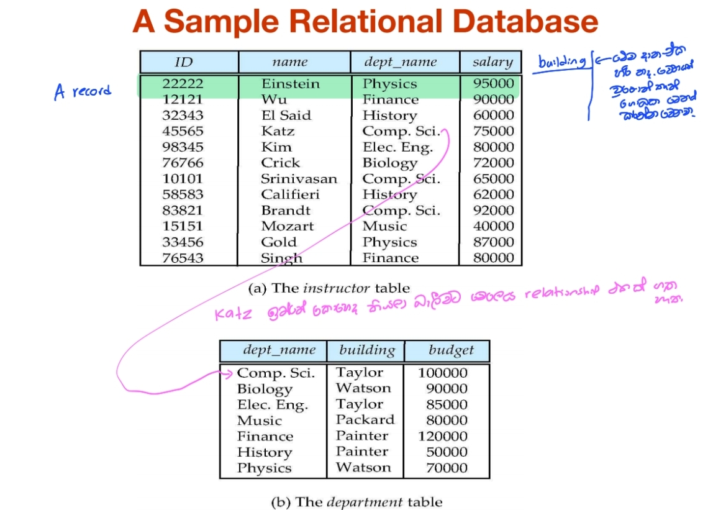

##### Entity Relationship model

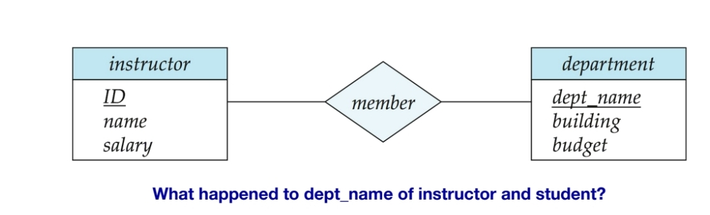

##### object based data model

today the concept of objects is well integrated into relational databases. Standards exist to store objects in relational tables. Database systems allow procedures to be stored in the database system and executed by the database system. This can be seen as extending the relational model with notions of encapsulation, methods, and object identity. 


------

## 1.3.2 Data Abstraction

Data abstraction is a key concept in database systems, which involves simplifying the complexity of data storage and manipulation by providing a simplified, abstract view to the users. It allows users to interact with data without needing to understand the intricacies of how data is stored, organized, or maintained.

##### Levels of Abstraction

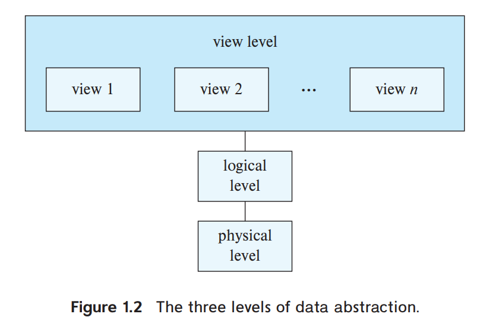

1. **Physical Level**: The lowest level of abstraction describes how the data is actually stored. This includes the details of data structures and the physical storage of data on hardware.
2. **Logical Level**: The middle level of abstraction describes what data is stored in the database and the relationships among those data. At this level, the database is presented in a way that abstracts away physical details and focuses on how data is logically organized. Although implementation of the simple structures at the logical level may involve complex physical-level structures, the user of the logical level does not need to be aware of this complexity. This is referred to as `physical data independence`. Database administrators, who must decide what information to keep in the database, use the logical level of abstraction
3. **View Level**: The highest level of abstraction describes only part of the entire database. It provides a way for users to interact with the system by defining different views for different users, each tailored to specific needs, without exposing unnecessary details.


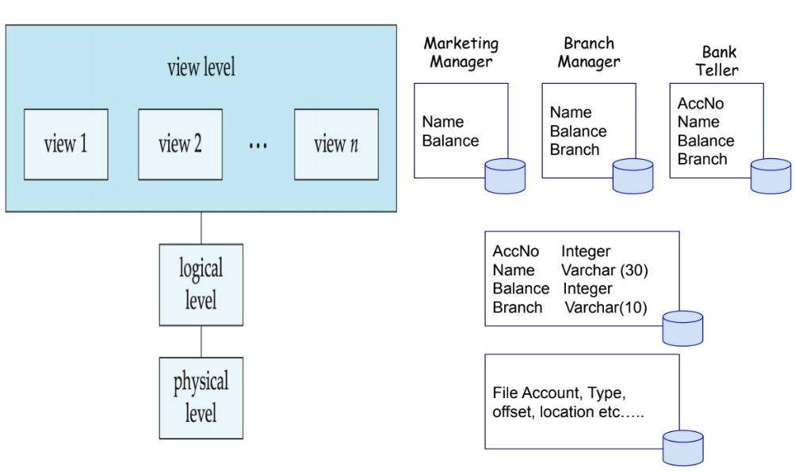

##### **Data Models and Abstraction**

Data models, such as the relational model, abstract the complexities of data storage. This abstraction allows application developers to interact with the database using high-level operations without worrying about low-level details. The database system translates these high-level operations into low-level operations that interact with the physical storage.

##### **Analogy with Programming Languages**

To understand the distinction among levels of abstraction, consider the analogy of data types in programming languages. Many high-level languages support structured types, which provide an abstract view of data structures. For example, the following code defines a structured record type called `instructor`:

```pascal
type instructor = record
    ID : char(5);
    name : char(20);
    dept_name : char(20);
    salary : numeric(8,2);
end;
```

This definition abstracts the details of the instructor's record structure, specifying only the field names and types. Similarly, a university database might include several record types, each abstractly defined:

- **instructor**: (ID, name, dept_name, salary)
- **department**: (dept_name, building, budget)
- **course**: (course_id, title, dept_name, credits)
- **student**: (ID, name, dept_name, tot_cred)

These abstract definitions allow developers and users to work with structured data without needing to understand the underlying storage mechanisms.


------

## 1.3.3 Instances and Schemas

Databases change over time as information is inserted and deleted. The collection of information stored in the database at a particular moment is called an **instance** of the database. The overall design of the database is called the **database schema**.

#### Analogy to Programming

- A database schema corresponds to the variable declarations (along with associated type definitions) in a program.
- Each variable has a particular value at a given instant, similar to how an instance represents the data at a specific moment in time.

#### Types of Schemas :building_construction:

Database systems have several schemas, partitioned according to levels of abstraction:

- **Physical Schema**: Describes the database design at the physical level.
- **Logical Schema**: Describes the database design at the logical level. `This is the most important schema for application programs.`
- **View Level Schemas (Subschemas)**: Describe different views of the database.

#### Physical Data Independence

- Application programs exhibit physical data independence if they do not depend on the physical schema and thus do not need to be rewritten if the physical schema changes.

#### Schema Design :notebook:

- Good schema design avoids problems such as unnecessarily duplicated information.
- For example, storing the department budget as an attribute of the instructor record can lead to inconsistencies if the budget value changes and must be updated in multiple places.

#### Flexibility in Logical Schemas

- Traditionally, logical schemas were changed infrequently.
- Newer database applications require more flexible logical schemas, where different records in a single relation may have different attributes.

------

# 1.4 Database Languages ​

A database system provides a `data-definition language (DDL)` to **specify the database schema** and a `data-manipulation language (DML)` to **express database queries and updates**. In practice, the data-definition and data-manipulation languages are not two separate languages; instead they simply form parts of a single database language, such as the SQL language. Almost all relational database systems employ the SQL language.

### SQL: Structured Query Language

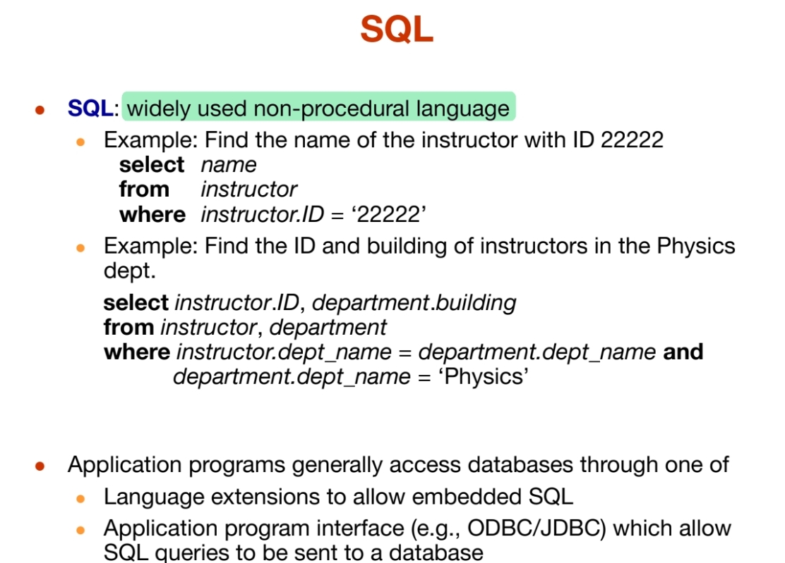

SQL (Structured Query Language) is a standard programming language specifically designed for managing and manipulating relational databases. SQL commands are divided into two main categories: `This is a nonprocedural query language`

1. **Data Definition Language (DDL)**
2. **Data Manipulation Language (DML)**

### Data Definition Language (DDL)

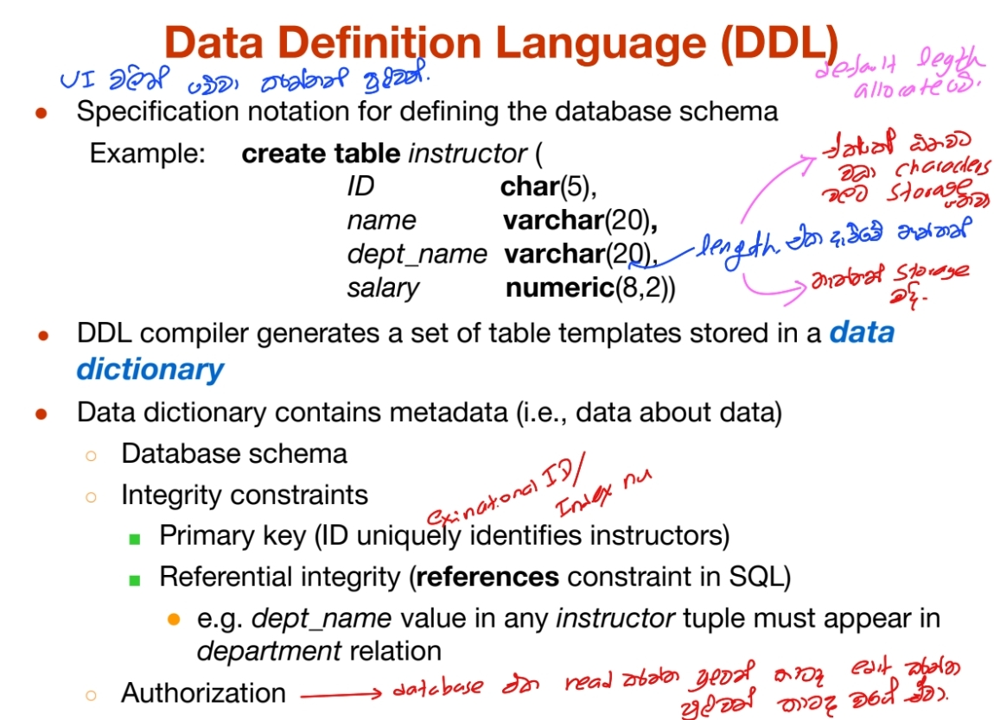

DDL is a subset of SQL used to define and manage database structures or schema. DDL commands are used to create, modify, and delete database objects such as tables, indexes, and constraints. Key DDL commands include:

- **CREATE**: Used to create new database objects.
  ```sql
  CREATE TABLE table_name (
    column1 datatype,
    column2 datatype,
    ...
  );

- **ALTER**: Used to modify existing database objects.

  ```sql
  ALTER TABLE table_name
  ADD column_name datatype;
  ```

- **DROP**: Used to delete database objects.

  ```sql
  DROP TABLE table_name;
  ```

- **TRUNCATE**: Used to remove all records from a table, but not the table itself.

  ```sql
  TRUNCATE TABLE table_name;
  ```

### Data Manipulation Language (DML)

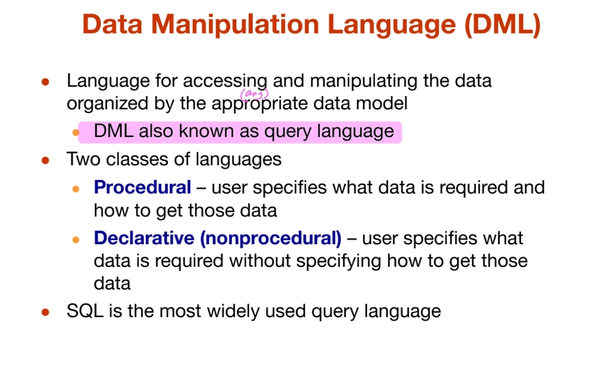

DML is a subset of SQL used for managing data within database objects. DML commands are used to retrieve, insert, update, and delete data in the database. Key DML commands include:

- **SELECT**: Used to retrieve data from the database.

  ```sql
  SELECT column1, column2, ...
  FROM table_name
  WHERE condition;
  ```

- **INSERT**: Used to add new records to a table.

  ```sql
  INSERT INTO table_name (column1, column2, ...)
  VALUES (value1, value2, ...);
  ```

- **UPDATE**: Used to modify existing records in a table.

  ```sql
  UPDATE table_name
  SET column1 = value1, column2 = value2, ...
  WHERE condition;
  ```

- **DELETE**: Used to remove records from a table

  ```sql
  DELETE FROM table_name
  WHERE condition;
  ```

### Summary

- **SQL** is the standard language for interacting with relational databases.
- **DDL** commands deal with the structure of the database.
- **DML** commands deal with the data within the database structures.

### Database Access from Application Programs

Examples in a university system are programs that allow students to register for courses, generate class rosters, calculate student GPA, generate payroll checks, and perform other tasks. To access the database, DML statements need to be sent from the host to the database where they will be executed. This is most commonly done by using an application-program interface (set of procedures) that can be used to send DML and DDL statements to the database and retrieve the results.

------

# 1.5 Database Design

### Overview

Database systems manage large bodies of information that are integral to enterprise operations. The design process primarily focuses on the database schema, which defines the structure of the data.

### High-Level Data Model

- **Purpose**: Provides a conceptual framework to specify data requirements and structure the database.
- **Initial Phase**: Characterizes user data needs through interaction with domain experts to gather user requirements.

### Conceptual Design Phase

- **Data Model Selection**: Choose a data model (e.g., relational or entity-relationship) to translate user requirements into a conceptual schema.
- **Schema Development**: Designs tables and defines relationships without focusing on physical storage details.

### Functional Requirements

- **Specification**: Describes operations or transactions users will perform on the data, such as modification, retrieval, and deletion.
- **Validation**: Review schema to ensure it meets functional requirements.

### Logical and Physical Design Phases

- **Logical Design**: Maps conceptual schema to the implementation data model of the chosen database system.
- **Physical Design**: Specifies physical features like file organization and storage structures.

### Conclusion

Database design involves translating user needs into a structured database schema, ensuring it meets functional requirements, and then proceeding to implement the logical and physical design phases to finalize the database structure.

------

# 1.6 Database Engine

A database system is partitioned into modules that deal with each of the responsibilities of the overall system. The functional components of a database system can be broadly divided into the <mark>storage manager, the query processor components, and the transaction management component.</mark>

### 1.6.1 Storage Manager

The storage manager is important because databases typically require a large amount of storage space. Corporate databases commonly range in size from hundreds of gigabytes to terabytes of data. Since the main memory of computers cannot store this much information, and since the contents of main memory are lost in a system crash, the information is stored on disks. Data are moved between disk storage and main memory as needed. Since the movement of data to and from disk is slow relative to the speed of the central processing unit, it is imperative that the database system structure the data so as to minimize the need to move data between disk and main memory. Increasingly, solid-state disks (SSDs) are being used for database storage. SSDs are faster than traditional disks but also more costly.

#### Components of Storage Manager
- **Authorization and Integrity Manager**: Tests for the satisfaction of integrity constraints and checks the authority of users to access data.
- **Transaction Manager**: Ensures that the database remains in a consistent state despite system failures, and that concurrent transaction executions proceed without conflicts.
- **File Manager**: Manages the allocation of space on disk storage and the data structures used to represent information stored on disk.
- **Buffer Manager**: Responsible for fetching data from disk storage into main memory, and deciding what data to cache in main memory. This is critical for handling data sizes larger than the main memory.

#### Data Structures Implemented by Storage Manager
- **Data Files**: Store the database itself.
- **Data Dictionary**: Stores metadata about the structure of the database, particularly the schema.
- **Indices**: Provide fast access to data items, similar to an index in a textbook.

### 1.6.2 The Query Processor

The query processor helps the database system simplify and facilitate access to data. It allows users to obtain good performance while working at the view level without understanding the physical-level details.

#### Components of Query Processor
- **DDL Interpreter**: Interprets DDL statements and records the definitions in the data dictionary.
- **DML Compiler**: Translates DML statements in a query language into an evaluation plan consisting of low-level instructions that the query-evaluation engine understands. It also performs query optimization by selecting the lowest cost evaluation plan from among alternatives.
- **Query Evaluation Engine**: Executes low-level instructions generated by the DML compiler.

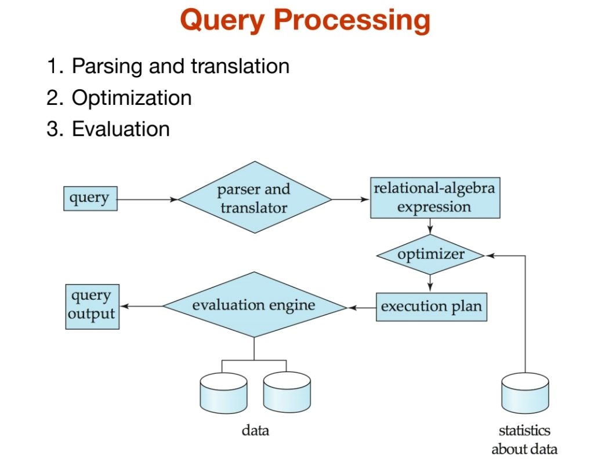

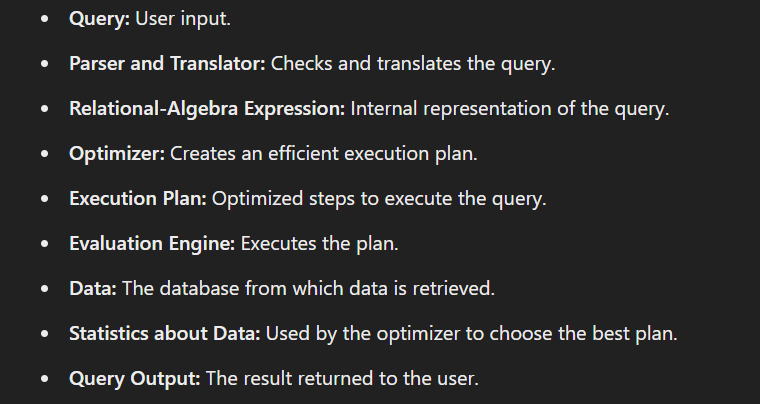

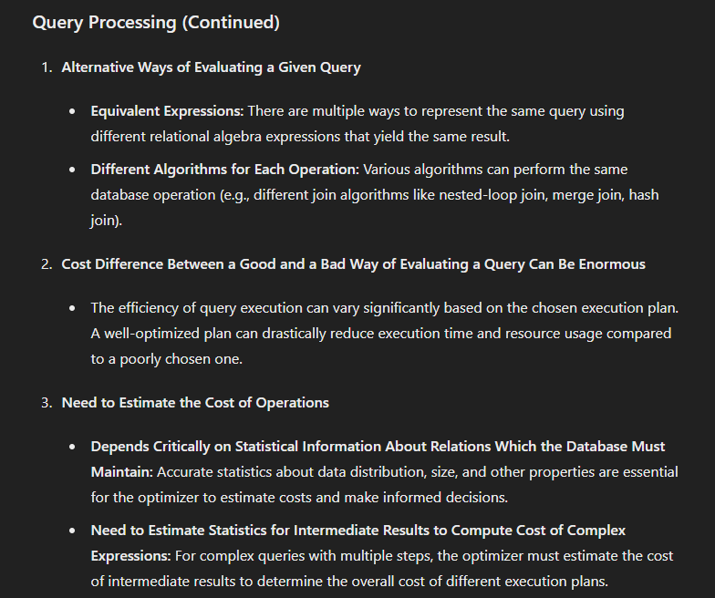

### 1.6.3 Transaction Management

The transaction manager allows application developers to treat a sequence of database accesses as a single unit that either happens in its entirety or not at all. This helps in managing concurrent access to data and handling system failures.

#### Key Concepts in Transaction Management
- **Atomicity**: Ensures that a transaction is fully completed or not executed at all.
- **Consistency**: Ensures that a transaction preserves the consistency of the database.
- **Durability**: Ensures that once a transaction is committed, the changes persist despite possible system failures.
- **Isolation**: Ensures that the execution of one transaction is isolated from other concurrent transactions.

#### Components of Transaction Management
- **Concurrency-Control Manager**: Manages the interaction among concurrent transactions to ensure data consistency.
- **Recovery Manager**: Detects system failures and restores the database to its prior state to ensure atomicity and durability.

### Modern Database Engines

While database engines were traditionally centralized computer systems, parallel processing is now key for handling very large amounts of data efficiently. Modern database engines focus on parallel data storage and parallel query processing.

---

### Storage Manager Details

The storage manager interacts with the file manager to store, retrieve, and update data in the database. It translates various DML statements into low-level file-system commands.

### Query Processor Details

The query processor includes the DDL interpreter, DML compiler, and query evaluation engine, which work together to translate and optimize queries for efficient execution.

### Transaction Management Details

Transaction management ensures atomicity, consistency, durability, and isolation of transactions, handling concurrent transactions and system failures through the concurrency-control manager and recovery manager.

---

### Summary

The database engine, encompassing the storage manager, query processor, and transaction management, is essential for efficiently managing large volumes of data, optimizing query performance, and ensuring data integrity and consistency in a database system.

------

# 1.7 Database  and application architecture

#### 1.7.1 database architecture 

The architecture of a database systems is greatly  influenced by the underlying computer system on which the  database is running:

| **Architecture**          | **Description**                                              | **Characteristics**                                          | **Use Case**                                                 |
| ------------------------- | ------------------------------------------------------------ | ------------------------------------------------------------ | ------------------------------------------------------------ |
| **Centralized Systems**   | All components run on a single server machine.               | Simplified management and maintenance. Potential bottlenecks due to single machine limitations. | Small to medium-sized applications with limited user interactions and data processing needs. |
| **Client-Server Systems** | Database resides on a server, application runs on clients.   | Enhanced processing power, improved user interface, better scalability. | Multiple users needing access to the same database, such as in business and educational settings. |
| **Parallel Systems**      | Utilizes multiple processors within a single machine or across a cluster. | Significant processing speed improvement, handles large data volumes, requires load balancing. | Large-scale data processing applications, including data warehousing and scientific computing. |
| **Distributed Systems**   | Database is spread across multiple geographically separated machines. | Enhanced reliability and availability, complex data consistency management, reduced latency. | Applications requiring high availability, disaster recovery, and distributed user bases, like global e-commerce. |

 The centralized architecture

#### 1.7.2 application architecture

| **Aspect**               | **Two-Tier Architecture**                                    | **Three-Tier Architecture**                                  |
| ------------------------ | ------------------------------------------------------------ | ------------------------------------------------------------ |
| **Generation**           | Earlier generation                                           | Modern approach                                              |
| **Client Role**          | Application resides on the client machine                    | Client machine acts as a front end without direct database calls |
| **Database Interaction** | Directly invokes database functionality at the server through query language statements | Front ends communicate with an application server, which then interacts with the database system |
| **Front Ends**           | Typically desktop applications                               | Web browsers, mobile applications                            |
| **Client Machine**       | Application and user interface layer                         | User interface layer                                         |
| **Application Server**   | Not present                                                  | Intermediary containing the business logic                   |
| **Database System**      | Backend where data is stored and managed                     | Backend where data is stored and managed                     |
| **Security**             | Less centralized control over database access                | Centralized control over database access                     |
| **Performance**          | Potential performance bottlenecks due to combined application and database load | Better performance due to the separation of concerns and more efficient resource utilization |

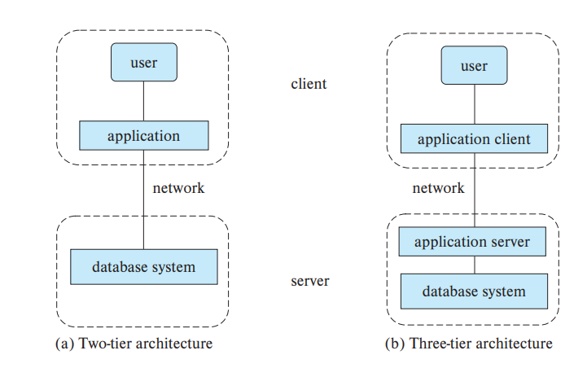

------

# 1.8 Database Users and Administrators

| User Category                    | Description                                                  | Role in DBMS                                                 |
| -------------------------------- | ------------------------------------------------------------ | ------------------------------------------------------------ |
| Naive Users                      | Casual end-users with minimal technical knowledge of databases. | Interact through simplified interfaces (forms, predefined queries). Perform basic operations like data retrieval and entry. |
| Application Programmers          | Proficient in programming languages, develop applications that interact with the database. | Use APIs provided by DBMS to integrate database functionality. Design queries, manage data transactions, ensure application efficiency. |
| Sophisticated Users ( analysts ) | Analysts with deep understanding of database concepts and query languages. | Perform complex data analysis, generate reports, derive insights from data. Write advanced queries, create views, use data mining techniques. |
| Database Administrators (DBAs)   | Manage and maintain the database system. Responsible for installation, configuration, security, performance tuning, backup and recovery. | Ensure data integrity, manage user access, schema modifications, optimize database resources. |

------

# 1.9 History of Database systems

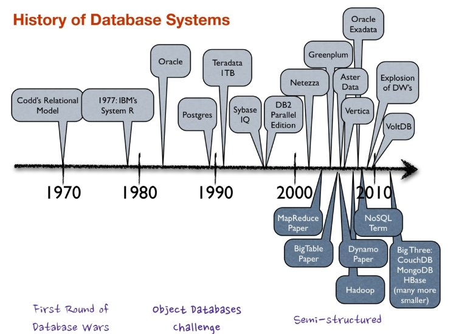
