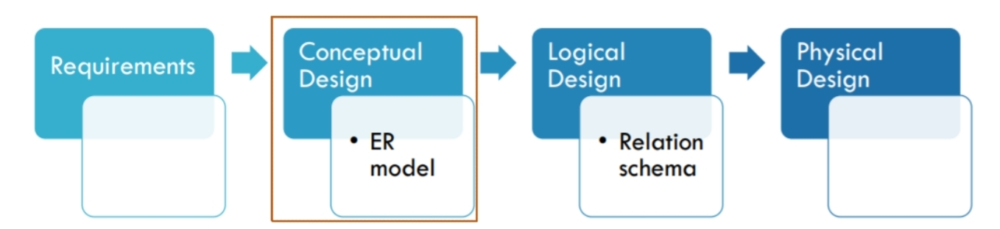
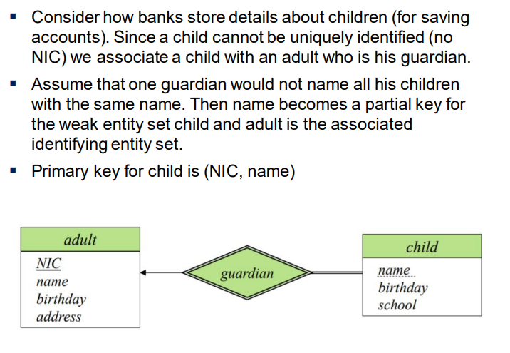
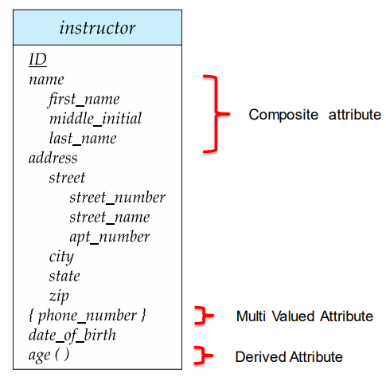
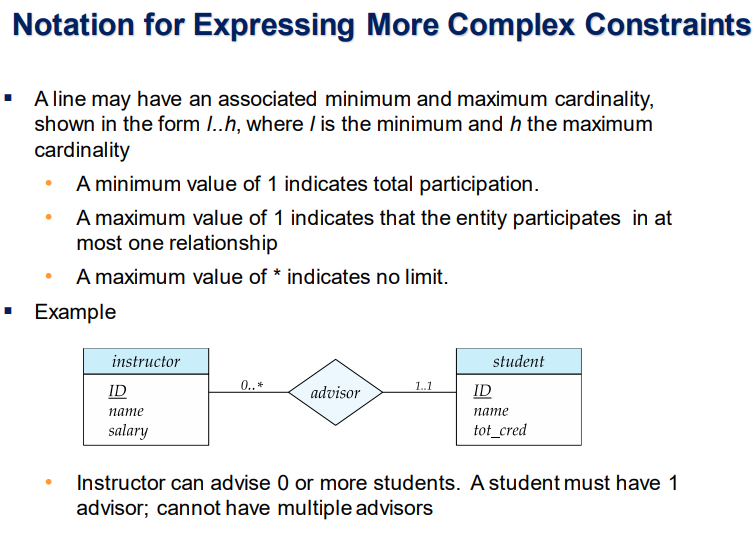
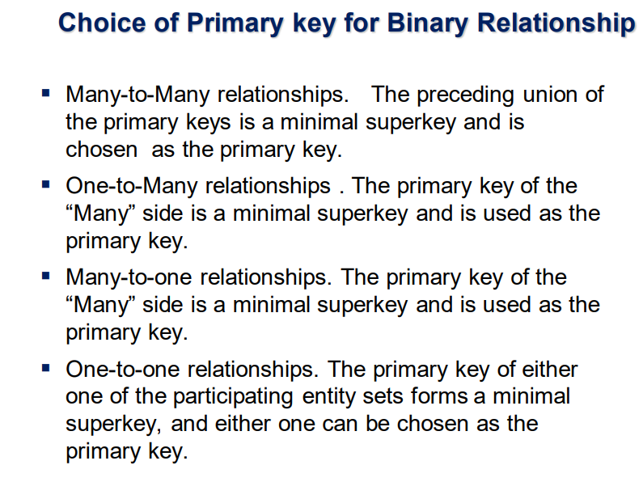
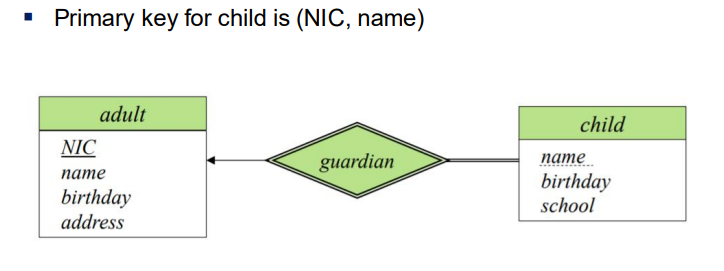
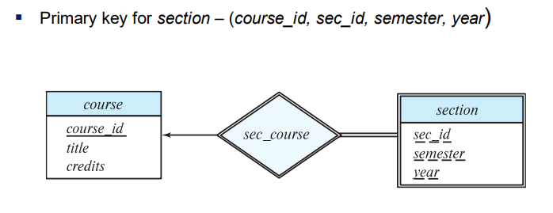
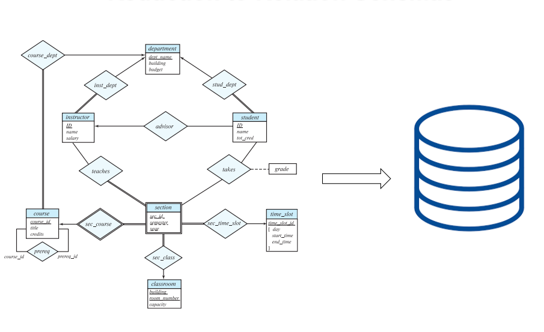
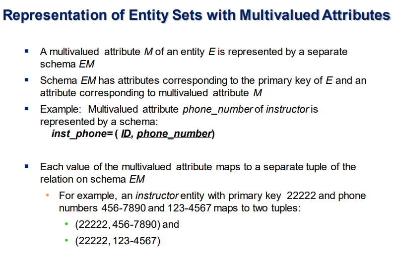
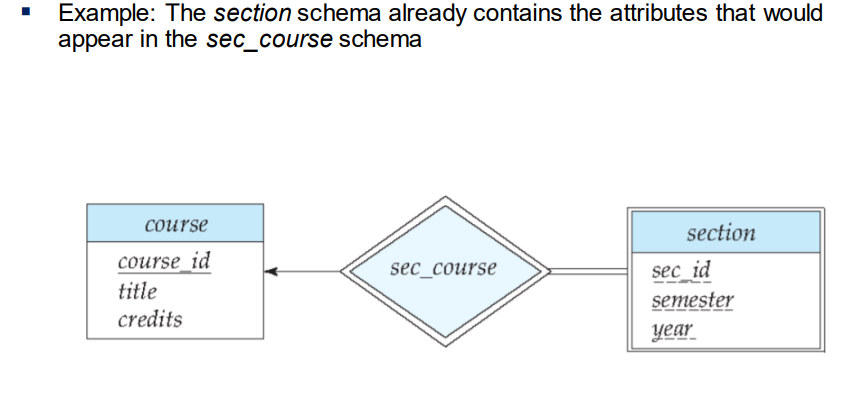

> Designing objectives :- Avoid Redundancies, Inconsistencies and incompleteness

1. #### Initial phase -- Characterize fully the data needs of the prospective database users.

2. #### <mark>Second Phase -- Choosing a data model (Conceptual Design)</mark> 

   - Applying the concepts of the chosen data model.
   - Translating these requirements into a conceptual schema of the database.
   - A fully developed conceptual schema indicates the functional requirements of the enterprise.

   **Describe the kinds of operations (or transactions) that will be performed on the data**.

3. #### Final Phase

   - Moving from an abstract data model to the implementation of the database
     - Logical Design
       - Deciding on the database schema.
       - Database design requires that we find a “good” collection of relation schemas.
       - **Business decision** – What attributes should we record in the database?
       - **Computer Science decision** – What relation schemas should we have and how should the attributes be distributed among the various relation schemas? ex:- How the GPS data can be stored rapidly for a service like uber
     - Physical Design
       - Deciding on the physical layout of the database.

------

## *Design Alternatives*


<u>Major Pitfalls to Avoid</u>

- Redundancy
  - A bad design may result in repeated information. (Storage Wasting)
  - Redundant representation of information may lead to data inconsistency among the various copies of information.
- Incompleteness
  - A bad design may make certain aspects of the enterprise difficult or impossible to model.
  - 

<u>Choosing Among Good Designs</u>

- Avoiding bad designs is not enough.
- There may be a large number of good designs from which we must choose.

------

# 1.Introduction of ER Model

Peter Chen developed the ER diagram in 1976 .The ER model was created to provide a simple and understandable model for representing the structure and logic of databases. It has since evolved into variations such as the Enhanced ER Model and the Object Relationship Model

The Entity Relational Model is a model for identifying entities to be represented in the database and representation of how those entities are related. The ER data model specifies enterprise schema that represents the overall logical structure of a database graphically. 

The Entity Relationship Diagram explains the relationship among the entities present in the database. ER models are used to model real-world objects like a person, a car, or a company and the relation between these real-world objects. In short, the ER Diagram is the structural format of the database. 

## Why Use ER Diagrams In DBMS?

- ER diagrams are used to represent the E-R model in a database, which makes them easy to convert into relations (tables).
- ER diagrams provide the purpose of real-world modeling of objects which makes them intently useful.
- ER diagrams require no technical knowledge and no hardware support.
- These diagrams are very easy to understand and easy to create even for a naive user. 
- It gives a standard solution for visualizing the data logically.

## Symbols Used in ER Model

ER Model is used to model the logical view of the system from a data perspective which consists of these symbols:

- ***\*Rectangles:\**** Rectangles represent Entities in the ER Model.
- ***\*Ellipses:\**** Ellipses represent Attributes in the ER Model.
- ***\*Diamond:\**** Diamonds represent Relationships among Entities.
- ***\*Lines:\**** Lines represent attributes to entities and entity sets with other relationship types.
- ***\*Double Ellipse:\**** Double Ellipses represent Multi-Valued Attributes.
- ***\*Double Rectangle:\**** Double Rectangle represents a Weak Entity.


​										Symbols used in ER Diagram

## Components of ER Diagram

ER Model consists of Entities, Attributes, and Relationships among Entities in a Database System.


​										Components of ER Diagram

### Entity

An Entity may be an object with a physical existence – a particular person, car, house, or employee – or it may be an object with a conceptual existence – a company, a job, or a university course. 

Entity are of two types

**1.Tangible Entity** – Which can be touched like car , person etc.

**2.Non – tangible Entity\*** – Which can’t be touched like air , bank account etc.

**Entity Set:** An Entity is an object of Entity Type and a set of all entities is called an entity set. For Example, E1 is an entity having Entity Type Student and the set of all students is called Entity Set. In ER diagram, Entity Type is represented as: 


​												Entity Set

We can represent the entity set in ER Diagram but can’t represent entity in ER Diagram because entity is row and column in the relation and ER Diagram is graphical representation of data.

#### *1. Strong Entity*

A [Strong Entity](https://www.geeksforgeeks.org/difference-between-strong-and-weak-entity/) is a type of entity that has a key Attribute. Strong Entity does not depend on other Entity in the Schema. It has a primary key, that helps in identifying it uniquely, and it is represented by a rectangle. These are called Strong Entity Types.

#### *2. Weak Entity*

An Entity type has a key attribute that uniquely identifies each entity in the entity set. But some entity type exists for which key attributes can’t be defined. These are called [Weak Entity types](https://www.geeksforgeeks.org/weak-entity-set-in-er-diagrams/). 

> # Weak Entity Set in ER diagrams
>
> An entity type should have a key attribute which uniquely identifies each entity in the entity set, but there exists some entity type for which key attribute can’t be defined. These are called Weak Entity type. 
>
> The entity sets which do not have sufficient attributes to form a [primary key](https://www.geeksforgeeks.org/dbms-keys-candidate-super-primary-alternate-and-foreign/) are known as **weak entity sets** and the entity sets which have a primary key are known as strong entity sets. 
>
> As the weak entities do not have any primary key, they cannot be identified on their own, so they depend on some other entity (known as owner entity). The weak entities have total [participation constraint](https://www.geeksforgeeks.org/database-management-system-er-model/) (existence dependency) in its identifying relationship with owner identity. Weak entity types have partial keys. Partial Keys are set of attributes with the help of which the tuples of the weak entities can be distinguished and identified. 
>
> **Note –** Weak entity always has total participation but Strong entity may not have total participation. 
>
> Weak entity is **depend on strong entity** to ensure the existence of weak entity. Like [strong entity](https://www.geeksforgeeks.org/difference-between-strong-and-weak-entity/), weak entity does not have any primary key, It has partial discriminator key. Weak entity is represented by double rectangle. The relation between one strong and one weak entity is represented by double diamond. 
>
>  
>
> 
>
> **Weak entities** are represented with **double rectangular** box in the ER Diagram and the identifying relationships are represented with double diamond. Partial Key attributes are represented with dotted lines. 
>
>  
>
> 
>
> **Example-1:** 
> In the below ER Diagram, ‘Payment’ is the weak entity. ‘Loan Payment’ is the identifying relationship and ‘Payment Number’ is the partial key. Primary Key of the Loan along with the partial key would be used to identify the records. 
>
>  
>
> 
>
> **Example-2:** 
> The existence of rooms is entirely dependent on the existence of a hotel. So room can be seen as the weak entity of the hotel. 
>
> **Example-3:** 
> The bank account of a particular bank has no existence if the bank doesn’t exist anymore. 
>
> **Example-4:** 
> A company may store the information of dependents (Parents, Children, Spouse) of an Employee. But the dependents don’t have existence without the employee. So Dependent will be weak entity type and Employee will be Identifying Entity type for Dependent. 
>
> **Other examples:** 
>  
>
> ```markdown
> Strong entity | Weak entity
> Order | Order Item
> Employee | Dependent
> Class | Section
> Host | Logins 
> ```
>
> **Note –** Strong-Weak entity set always has parent-child relationship.
>
> 

***\*For Example,\**** A company may store the information of dependents (Parents, Children, Spouse) of an Employee. But the dependents can’t exist without the employee. So Dependent will be a ***\*Weak Entity Type\**** and Employee will be Identifying Entity type for Dependent, which means it is ***\*Strong Entity Type\****.

A weak entity type is represented by a Double Rectangle. <u>The participation of weak entity types is always total</u>. The relationship between the weak entity type and its identifying strong entity type is called identifying relationship and it is represented by a double diamond. 


​										Strong Entity and Weak Entity

### Attributes

[Attributes](https://www.geeksforgeeks.org/types-of-attributes-in-er-model/) are the properties that define the entity type. For example, Roll_No, Name, DOB, Age, Address, and Mobile_No are the attributes that define entity type Student. In ER diagram, the attribute is represented by an oval. 


​												Attribute

#### *1. Key Attribute*

The attribute which ***\*uniquely identifies each entity\**** in the entity set is called the key attribute. For example, Roll_No will be unique for each student. In ER diagram, the key attribute is represented by an oval with underlying lines.


​												Key Attribute

#### *2. Composite Attribute*

An attribute **composed of many other attributes** is called a composite attribute. For example, the Address attribute of the student Entity type consists of Street, City, State, and Country. In ER diagram, the composite attribute is represented by an oval comprising of ovals. 


​											Composite Attribute

#### *3. Multivalued Attribute*

An attribute consisting of more than one value for a given entity. For example, Phone_No (can be more than one for a given student). In ER diagram, a multivalued attribute is represented by a double oval. 


​											Multivalued Attribute

#### *4. Derived Attribute*

An attribute that can be derived from other attributes of the entity type is known as a derived attribute. e.g.; Age (can be derived from DOB). In ER diagram, the derived attribute is represented by a dashed oval. 


​											Derived Attribute

The Complete Entity Type Student with its Attributes can be represented as: 


​										Entity and Attributes



### Relationship Type and Relationship Set

<mark>▪ A relationship is an association among several entities</mark>

A Relationship Type represents the association between entity types. For example, ‘Enrolled in’ is a relationship type that exists between entity type Student and Course. In ER diagram, the relationship type is represented by a diamond and connecting the entities with lines. 


Entity-Relationship Set

A set of relationships of the same type is known as a relationship set. The following relationship set depicts S1 as enrolled in C2, S2 as enrolled in C1, and S3 as registered in C3.


​											Relationship Set

#### <u>Degree of a Relationship Set</u>

The number of different entity sets participating in a relationship set is called the [degree of a relationship set.](https://www.geeksforgeeks.org/degree-of-relations-in-dbms/) 

***\*1. Unary Relationship:\**** When there is only ONE entity set participating in a relation, the relationship is called a unary relationship. For example, one person is married to only one person. 


​											Unary Relationship

***\*2. Binary Relationship:\**** When there are TWO entities set participating in a relationship, the relationship is called a binary relationship. For example, a Student is enrolled in a Course. 


​											Binary Relationship

***\*3. Ternary Relationship:\**** When there are n entities set participating in a relation, the relationship is called an n-ary relationship. 

#### <u>Cardinality</u>

The number of times an entity of an entity set participates in a relationship set is known as [cardinality](https://www.geeksforgeeks.org/cardinality-in-dbms/). Cardinality can be of different types: 

***\*1. One-to-One:\**** When each entity in each entity set can take part only once in the relationship, the cardinality is one-to-one. Let us assume that a male can marry one female and a female can marry one male. So the relationship will be one-to-one. 

the total number of tables that can be used in this is 2.


​											one to one cardinality

Using Sets, it can be represented as: 


​										Set Representation of One-to-One

***\*2. One-to-Many:\**** In one-to-many mapping as well where each entity can be related to more than one entity and the total number of tables that can be used in this is 2. Let us assume that one surgeon department can accommodate many doctors. So the Cardinality will be 1 to M. It means one department has many Doctors.

total number of tables that can used is 3.


​											one to many cardinality

Using sets, one-to-many cardinality can be represented as:


​									Set Representation of One-to-Many

***\*3. Many-to-One:\**** When entities in one entity set can take part only once in the relationship set and entities in other entity sets can take part more than once in the relationship set, cardinality is many to one. Let us assume that a student can take only one course but one course can be taken by many students. So the cardinality will be n to 1. It means that for one course there can be n students but for one student, there will be only one course. 

The total number of tables that can be used in this is 3.


​										many to one cardinality

Using Sets, it can be represented as:


​										Set Representation of Many-to-One

In this case, each student is taking only 1 course but 1 course has been taken by many students. 

***\*4. Many-to-Many:\**** When entities in all entity sets can take part more than once in the relationship cardinality is many to many. Let us assume that a student can take more than one course and one course can be taken by many students. So the relationship will be many to many. 

the total number of tables that can be used in this is 3.


​											many to many cardinality

Using Sets, it can be represented as: 


​									Many-to-Many Set Representation

In this example, student S1 is enrolled in C1 and C3 and Course C3 is enrolled by S1, S3, and S4. So it is many-to-many relationships. 

### <u>Participation Constraint</u>

[Participation Constraint](https://www.geeksforgeeks.org/structural-constraints-of-relationships-in-er-model/) is applied to the entity participating in the relationship set. 

***\*1. Total Participation –\**** Each entity in the entity set must participate in the relationship. If each student must enroll in a course, the participation of students will be total. Total participation is shown by a double line in the ER diagram. 

***\*2. Partial Participation –\**** The entity in the entity set may or may NOT participate in the relationship. If some courses are not enrolled by any of the students, the participation in the course will be partial. 

The diagram depicts the ‘Enrolled in’ relationship set with Student Entity set having total participation and Course Entity set having partial participation. 


​										Total Participation and Partial Participation

Using Set, it can be represented as, 


​							Set representation of Total Participation and Partial Participation

Every student in the Student Entity set participates in a relationship but there exists a course C4 that is not taking part in the relationship. 

## How to Draw ER Diagram?

- The very first step is Identifying all the Entities, and place them in a Rectangle, and labeling them accordingly.
- The next step is to identify the relationship between them and place them accordingly using the Diamond, and make sure that, Relationships are not connected to each other.
- Attach attributes to the entities properly.
- Remove redundant entities and relationships.
- Add proper colors to highlight the data present in the database.

------

# 2. Structural Constraints of Relationships in ER Model

Prerequisite – [ER Model](https://www.geeksforgeeks.org/introduction-of-er-model/) To understand Structural Constraints, we must take a look at Cardinality Ratios and Participation Constraints.

 **Cardinality Ratios of relationships :** The entities are denoted by rectangle and relationships by diamond.There are numbers (represented by M and N) written above the lines which connect relationships and entities. These are called cardinality ratios. These represent the maximum number of entities that can be associated with each other through relationship, R. 

**Types of Cardinality :** There can be 4 types of cardinality –

1. **One-to-one (1:1) –** When one entity in each entity set takes part at most once in the relationship, the cardinality is one-to-one.
2. **One-to-many (1: N) –** If entities in the first entity set take part in the relationship set at most once and entities in the second entity set take part many times (at least twice), the cardinality is said to be one-to-many.
3. **Many-to-one (N:1) –** If entities in the first entity set take part in the relationship set many times (at least twice), while entities in the second entity set take part at most once, the cardinality is said to be many-to-one.
4. **Many-to-many (N: N) –** The cardinality is said to be many to many if entities in both the entity sets take part many times (at least twice) in the relationship set.

**Participation Constraints :** Participation Constraints tell us that the participation in a relationship can either be total or partial.

When each entity in an entity set participates in a relation, it is called *Total Participation*. However, when all entities in the given entity set do not participate in a relation, it is called *Partial Participation*. **Structural Constraints :** Structural Constraints are also called Structural properties of a database management system (DBMS). Cardinality Ratios and Participation Constraints taken together are called Structural Constraints. The name constraints refer to the fact that such limitations must be imposed on the data, for the DBMS system to be consistent with the requirements.


The Structural constraints are represented by **Min-Max notation**. This is a pair of numbers(m, n) that appear on the connecting line between the entities and their relationships. The minimum number of times an entity can appear in a relation is represented by m whereas, the maximum time it is available is denoted by n. If m is 0 it signifies that the entity is participating in the relation partially, whereas, if m is either greater than or equal to 1, it denotes total participation of the entity. **Note –** Number of times an entity participates in a relationship is same as the number appearance of the entity in the tuples.



------

# 3.Primary key

A primary key is a unique identifier for records in a database table. It ensures that each record can be uniquely identified and provides a way to establish relationships between different entities. Here’s an overview of how primary keys apply to different database concepts:

### 1. Entity Sets

Entity sets represent collections of entities of the same type that share the same properties. Each entity in an entity set must be uniquely identifiable, and this is where the primary key comes into play.

- **Example:** In an entity set `Students`, a `student_id` can be used as the primary key to uniquely identify each student.

### 2. Relationship Sets

Relationship sets represent associations between entity sets. A relationship set can also have a primary key, especially in many-to-many relationships, where a composite key is often used.

- **Example:** In a relationship set `Enrollments` between `Students` and `Courses`, a composite primary key might be `(student_id, course_id)` to ensure each enrollment record is unique.

>  
>
> Super Key is an attribute (or set of attributes) that is used to uniquely identifies all attributes in a relation. Primary Key is a minimal set of attribute (or set of attributes) that is used to uniquely identifies all attributes in a relation. 2. All super keys can't be primary keys

### 3. Weak Entity Sets

Weak entity sets are entity sets that cannot be uniquely identified by their own attributes alone. They depend on another entity set, called the owner entity set, for their identification. <mark>Weak entity sets must have a partial key(discriminator) and are uniquely identified by the combination of this partial key and the primary key of the owner entity set.</mark>

- **Example:** Consider an entity set `Dependents` associated with the entity set `Employees`. The `Dependents` entity set might have a partial key `dependent_name`, but it needs the `employee_id` from the `Employees` entity set to form a composite key `(employee_id, dependent_name)` to uniquely identify each dependent.

We underline the discriminator of a weak entity set with a dashed  line.

 

### Summary

- **Primary Keys:** Uniquely identify records in a table, ensuring no two records have the same primary key value.
- **Entity Sets:** Use primary keys to uniquely identify each entity.
- **Relationship Sets:** May use composite primary keys to uniquely identify each association.
- **Weak Entity Sets:** Use a combination of a partial key (discriminator) and the primary key of the owner entity set to ensure unique identification.

------

# **<u>Reduction to relation schema (logical design)</u>**



When designing a relational database, the concepts from an Entity-Relationship (E-R) diagram are translated into a collection of relation schemas. This process involves converting entity sets and relationship sets into tables that can be managed by a relational database management system (RDBMS). Here’s how this conversion is typically done:

### 1. Entity Sets

Each entity set in the E-R diagram is converted into a table (relation schema). The attributes of the entity set become the columns of the table.

- Example:
  - **Entity Set:** `Student`
  - **Attributes:** `student_id`, `name`, `date_of_birth`
  - **Relation Schema:** `Student(student_id, name, date_of_birth)`
  - **Primary Key:** `student_id`

### 2. Relationship Sets

Each relationship set in the E-R diagram is also converted into a table. The attributes of the relationship set become the columns of the table. The primary key of the relationship set typically includes the primary keys of the participating entity sets.

- Example:
  - **Relationship Set:** `Enrollment` between `Student` and `Course`
  - **Attributes:** `student_id`, `course_id`, `enrollment_date`
  - **Relation Schema:** `Enrollment(student_id, course_id, enrollment_date)`
  - **Primary Key:** `(student_id, course_id)`

### 3. Weak Entity Sets

Weak entity sets are converted into tables, but their primary keys are composed of their partial key and the primary key of the owner entity set.

- Example:
  - **Entity Set:** `Dependent`
  - **Attributes:** `employee_id`, `dependent_name`, `relationship`
  - **Relation Schema:** `Dependent(employee_id, dependent_name, relationship)`
  - **Primary Key:** `(employee_id, dependent_name)`

### Process Summary

1. **Identify Entity Sets:**
   - Create a table for each entity set.
   - Include all attributes as columns.
   - Assign the primary key of the entity set as the primary key of the table.
2. **Identify Relationship Sets:**
   - Create a table for each relationship set.
   - Include the primary keys of the participating entity sets as columns.
   - Include any additional attributes of the relationship as columns.
   - Assign a composite primary key that includes the primary keys of the participating entity sets.
3. **Identify Weak Entity Sets:**
   - Create a table for each weak entity set.
   - Include the partial key of the weak entity set and the primary key of the owner entity set as columns.
   - Include any additional attributes as columns.
   - Assign a composite primary key that includes the partial key and the primary key of the owner entity set.

### Example

Given an E-R diagram with the following components:

- Entity Sets: `Student(student_id, name, date_of_birth)`, `Course(course_id, course_name)`
- Relationship Set: `Enrollment(student_id, course_id, enrollment_date)`
- Weak Entity Set: `Dependent(employee_id, dependent_name, relationship)`

The resulting relational schemas would be:

1. `Student(student_id, name, date_of_birth)`
2. `Course(course_id, course_name)`
3. `Enrollment(student_id, course_id, enrollment_date)`
4. `Dependent(employee_id, dependent_name, relationship)`

 

------

## Redundancy in Schemas 

#### *1.for Many-to-One and One-to-Many Relationships*

In database design, when dealing with many-to-one and one-to-many relationships that are total on the many side (meaning every entity on the many side must be related to an entity on the one side), there are strategies to represent these relationships efficiently to avoid redundancy. One common approach is to add an extra attribute to the table on the "many" side that references the primary key of the "one" side entity. This helps in maintaining data integrity and reduces redundancy. Here's how it works with an example:

##### <u>Example Scenario</u>

Let's consider an example scenario with the following entities and relationships:

- **Entity Set:** `Instructor`
  - **Attributes:** `instructor_id`, `name`, `dept_name`
- **Entity Set:** `Department`
  - **Attributes:** `dept_name`, `location`
- **Relationship Set:** `Instructor_Department`
  - **Attributes:** `instructor_id`, `dept_name`

##### <u>Normal Approach</u>

In a typical scenario without redundancy considerations, you might have separate tables for `Instructor` and `Department`, and a separate table (`Instructor_Department`) to represent the relationship between them. This `Instructor_Department` table would have foreign keys `instructor_id` referencing `Instructor` and `dept_name` referencing `Department`.

##### <u>Reducing Redundancy Approach</u>

To reduce redundancy, especially when the relationship is total on the many side (every instructor belongs to a department), you can embed the department information directly into the `Instructor` table. This can be achieved by adding a `dept_name` attribute to the `Instructor` table:

- Updated Instructor Schema with Redundancy Reduction:
  - Instructor(instructor_id, name, dept_name, ...)
    - Here, `dept_name` is a foreign key referencing `Department`.

##### <u>Benefits</u>

1. **Avoidance of Join Operations:** With the department information directly in the `Instructor` table, you avoid frequent join operations when querying information about instructors and their departments.
2. **Simplified Queries:** Queries that involve information from both `Instructor` and `Department` can be simplified since the necessary information is already present in the `Instructor` table.
3. **Improved Performance:** Reducing joins can improve query performance, especially in large databases with complex relationships.

##### <u>Considerations</u>

- **Data Redundancy:** While reducing joins and improving query performance, redundancy must be managed carefully to ensure data integrity. Updates to the department information should be consistent across all relevant tables.
- **Normalization:** Care should be taken to ensure the database schema remains normalized to avoid anomalies and maintain data consistency.

##### <u>Conclusion</u>

By adding attributes that reference the primary keys of related entities directly into tables, you can reduce redundancy and improve database performance, especially in scenarios where relationships are well-defined and total on the many side. This approach is a common optimization technique in database design.

### *2.One-to-One Relationship Sets*

In a one-to-one relationship between two entity sets, you have flexibility in choosing which side acts as the "many" side. This flexibility allows you to add an extra attribute to either of the tables corresponding to the two entity sets.

- Example Scenario:
  - Suppose you have two entity sets: `Employee` and `Office`.
  - If each employee is assigned to exactly one office and each office is assigned to exactly one employee, you can choose either `Employee` or `Office` to include an extra attribute referencing the primary key of the other.
  - This extra attribute establishes the one-to-one relationship without needing a separate table for the relationship.

##### <u>*Partial Participation on the Many Side*</u>

If participation in a relationship is partial on the "many" side, it means not every entity in that set needs to be related to an entity on the other side. In such cases, when you add an extra attribute to the "many" side's schema, there might be instances where this attribute contains null values.

- Example Scenario:
  - Consider a scenario where not every department has a head (manager).
  - If you add a `manager_id` attribute to the `Department` schema to represent the head of the department, departments without a manager would have `NULL` values in this attribute.

### *3.Redundancy in Weak Entity Sets*

When dealing with a weak entity set (which cannot be identified uniquely without considering some other entity), the schema corresponding to the relationship linking it to its identifying strong entity set can be redundant.

- Example Scenario:
  - Suppose you have a weak entity set `Dependent` that depends on the entity set `Employee`.
  - The attributes of `Dependent` may include `employee_id`, which is part of its primary key along with `dependent_name`.
  - In this case, duplicating attributes related to `Employee` in `Dependent` would lead to redundancy because `Dependent` already relies on `Employee` for identification.

##### <u>Example: Section and Sec_Course Schemas</u>

In the context of a database schema:

- A `Section` schema might include attributes like `section_id`, `course_id`, `instructor_id`, etc.

- A `Sec_Course` schema would typically have attributes related to specific sections of courses, potentially overlapping with attributes already present in the `Section` schema.

- Consolidating related information into fewer schemas helps to minimize redundancy and maintain a clearer data model.

  

These principles guide database designers in optimizing schema designs, ensuring efficient data storage, and minimizing redundancy while maintaining data integrity. Each decision regarding schema structure should consider the specific needs of the application and the relationships between entities and their attributes.

------

# <u>Extended E-R Features</u>

## Generalization, Specialization and Aggregation in ER Model

Using the ER model for bigger data creates a lot of complexity while designing a database model, So in order to minimize the complexity Generalization, Specialization, and Aggregation were introduced in the ER model and these were used for data abstraction in which an abstraction mechanism is used to hide details of a set of objects. Some of the terms were added to the Enhanced ER Model, where some new concepts were added. These new concepts are:

- Generalization
- Specialization
- Aggregation

#### ***1.Generalization***

Generalization is the process of extracting common properties from a set of entities and creating a generalized entity from it. It is a bottom-up approach in which two or more entities can be generalized to a higher-level entity if they have some attributes in common. For Example, STUDENT and FACULTY can be generalized to a higher-level entity called PERSON as shown in Figure 1. In this case, common attributes like P_NAME, and P_ADD become part of a higher [entity](https://www.geeksforgeeks.org/difference-between-entity-and-object/) (PERSON), and specialized [attributes](https://www.geeksforgeeks.org/types-of-attributes-in-er-model/) like S_FEE become part of a specialized entity (STUDENT). 

<mark>Generalization is also called as ‘ Bottom-up approach”.</mark>


​											Generalization

#### ***2.Specialization***

In specialization, an entity is divided into sub-entities based on its characteristics. It is a top-down approach where the higher-level entity is specialized into two or more lower-level [entities](https://www.geeksforgeeks.org/difference-between-entity-entity-set-and-entity-type/). For Example, an EMPLOYEE entity in an Employee management system can be specialized into DEVELOPER, TESTER, etc. as shown in Figure 2. In this case, common attributes like E_NAME, E_SAL, etc. become part of a higher entity (EMPLOYEE), and specialized attributes like TES_TYPE become part of a specialized entity (TESTER). 

<mark>Specialization is also called as ” Top-Down approach”.</mark>


​											Specialization

<mark>Inheritance: It is an important feature of generalization and specialization</mark>

- **Attribute inheritance**: allows lower level entities to inherit the attributes of higher level entities and vice versa.
- in diagram: **Car** entity is an inheritance of **Vehicle** entity ,So Car can acquire attributes of  **Vehicle** example :car can acquire **Model** attribute of **Vehicle**.
- **Participation inheritance**: In participation inheritance, relationships involving higher level entity set also inherited by lower level entity and vice versa.
- in diagram: Vehicle entity has an relationship with Cycle entity ,So **Cycle entity** can acquire attributes of lower level entities i.e **Car** and **Bus** since it is inheritance of **Vehicle.**


​										Example of Relation

#### ***3.Aggregation***

An ER diagram is not capable of representing the relationship between an entity and a relationship which may be required in some scenarios. In those cases, a relationship with its corresponding entities is aggregated into a higher-level entity. Aggregation is an abstraction through which we can represent relationships as higher-level entity sets.

For Example, an Employee working on a project may require some machinery. So, REQUIRE relationship is needed between the relationship WORKS_FOR and entity MACHINERY. Using aggregation, WORKS_FOR relationship with its entities EMPLOYEE and PROJECT is aggregated into a single entity and relationship REQUIRE is created between the aggregated entity and MACHINERY.


​												Aggregation

##### ***\*Representing Aggregation Via Schema\****

To represent aggregation, create a schema containing the following things.

- the [primary key](https://www.geeksforgeeks.org/primary-key-constraint-in-sql/) to the aggregated relationship
- the primary key to the associated entity set
- descriptive attribute, if exists

## FAQs on Generalization, Specialization and Aggregation in ER Model

#### Q.1: What are Generalization, Specialization, and Aggregation in ER Model?

***\*Answer:\****

> Generalization is the higher level of understanding of data from lower levels of data whereas Specialization is the process of defining one or more entities from present entities and Aggregation is the process of combining two or more entities.

#### Q.2: What is the purpose of the Generalization?

***\*Answer:\****

> Generalization is simply gathering the common properties from entities and creating a generalized concept from those extracted data. Generalization helps in improving the flexibility, and reusability of the database.

#### Q.3: Why is generalization important in the database?

***\*Answer:\****

> Generalization is important in the database because it helps to gather important information so that it becomes easier and faster for the user the analysis of data and it also helps in making decisions faster.

