## <u>JDBC ( Java Database Connectivity )</u>

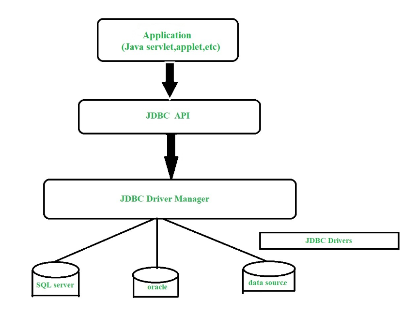

- **JDBC** is a Java API to connect and execute the query with the database.
- It is a specification from Sun Microsystems that provides a standard abstraction(API or Protocol) for Java applications to communicate with various databases. It provides the language with Java database connectivity standards.
- It is used to write programs required to access databases.
- JDBC, along with the database driver, can access databases and spreadsheets. The enterprise data stored in a relational database(RDB) can be accessed with the help of JDBC APIs.
- Model for communicating with the database:
  - Open a connection
  - Create a “statement” object
  - Execute queries using the Statement object to send queries and fetch results
  - Close the connections
  - Handle errors using an exception mechanism

- Example:

```java
import java.sql.*; // Importing the necessary classes for SQL interaction

// Defining database connection variables
static final String DB_URL = "jdbc:mysql://localhost/university"; // Database URL
static String USER; // Placeholder for the database username
static String PASSWORD; // Placeholder for the database password
static final String QUERY = "SELECT ID, name FROM student"; // SQL query to retrieve ID and name 

// The code attempts to establish a connection and fetch results from the database
try (Connection conn = DriverManager.getConnection(DB_URL, USER, PASSWORD); // Establishing connection to the database
     Statement stmt = conn.createStatement(); // Creating a statement object to execute the query
     ResultSet rs = stmt.executeQuery(QUERY)) { // Executing the query and storing the result set
    
    // Loop through the result set
    while (rs.next()) { 
        // Retrieve data from each row in the result set
        System.out.println("ID: " + rs.getInt("id")); // Print the ID column value
        System.out.println("Name: " + rs.getString("name")); // Print the Name column value
    }
} catch (SQLException e) { 
    e.printStackTrace(); // Handle any SQL exception that occurs
}

```

**Update the Database (INSERT operation)**

```java
try {
    statement.executeUpdate("INSERT INTO instructor VALUES ('77987','Kim','Physics',98000)");
} catch (SQLException e) {
    log.error("Unable to access the database server: ", e);
}
```

- **Explanation**:
  - **`statement.executeUpdate()`**: This method is used to execute SQL statements that change the database (e.g., `INSERT`, `UPDATE`, `DELETE`). It returns the number of rows affected by the SQL statement.
  - **`try-catch` block**: It handles any `SQLException` that may occur during the database operation. If an error occurs (e.g., the database is unreachable, or there's a constraint violation), the exception is caught and logged using `log.error()`.


**Execute Query and Fetch Results (SELECT operation)**

```java
ResultSet resultSet = statement.executeQuery("SELECT dept_name, AVG(salary) FROM instructor GROUP BY dept_name");
while (resultSet.next()) {
    System.out.println(resultSet.getString("dept_name") + " : " + resultSet.getFloat(2));
}
```

- **Explanation**:
  - **`statement.executeQuery()`**: This method is used to execute SQL `SELECT` queries and returns a `ResultSet` object, which contains the results of the query.
  - **`ResultSet`**: A `ResultSet` object holds the data retrieved from the database. It provides methods to navigate through the results.
  - **`resultSet.next()`**: This method moves the cursor to the next row in the result set. It returns `true` if there are more rows, and `false` if there are no more.


- When fetching results from a `ResultSet`, you can retrieve column values by either the **column name** or **column index**.


```java
resultSet.getString("dept_name");
```
- This retrieves the value of the `dept_name` column from the current row of the `ResultSet`.
- Use this method when you know the exact name of the column in the query result.

```java
resultSet.getString(1);
```
- This retrieves the value of the first column in the result set.

- Useful when you don’t know the exact column name or want to refer to it by its order in the `SELECT` statement.

  

**Handling Empty Result Set:**

- If the `ResultSet` is empty (i.e., there are no rows returned from the query), you should handle it properly. This can be done by checking if `ResultSet.next()` returns `false` before accessing any data.


```java
ResultSet resultSet = statement.executeQuery("SELECT dept_name, AVG(salary) FROM instructor GROUP BY dept_name");

if (!resultSet.next()) {
    System.out.println("No data found.");
} else {
    do {
        // Process each row
        String deptName = resultSet.getString("dept_name");
        float avgSalary = resultSet.getFloat(2);
        System.out.println(deptName + " : " + avgSalary);
    } while (resultSet.next());
}
```

**Handling Potential NULL Values:**

- Even if a row exists, some fields might contain `NULL` values, which can be problematic. JDBC provides methods to handle `NULL` values explicitly.

  - Use `ResultSet.wasNull()` to check if the last retrieved column value was `NULL`.


Example:
```java
String deptName = resultSet.getString("dept_name");
if (resultSet.wasNull()) {
    deptName = "Unknown Department";  // Handle null by assigning a default value
}

Float avgSalary = resultSet.getFloat(2);
if (resultSet.wasNull()) {
    avgSalary = 0.0f;  // Handle null salary
}
System.out.println(deptName + " : " + avgSalary);
```


### <u>Prepared Statements and SQL injection</u>

- <mark>Always use Prepared Statements if the parameters for a query are taken as user inputs.</mark>

- A prepared statement in MySQL represents a precompiled statement.
- A statement is compiled and stored in a prepared statement and you can later execute this multiple times. Instead of values we pass place holders to this statement.
- If you want to execute several identical queries (that differ by values only), You can use prepared statements. You can execute these statements in client libraries as well as in SQL scripts.
- A SQL prepared statement is based on three statements namely;
  - PREPARE
  - EXECUTE
  - DEALLOCATE PREPARE


#### 1. **Using Prepared Statement for INSERT Operation**
   ```java
   PreparedStatement preparedStatement = connection.prepareStatement("INSERT INTO instructor VALUES(?,?,?,?)");
   preparedStatement.setString(1, "88877");   // Set the first parameter (ID)
   preparedStatement.setString(2, "Perry");   // Set the second parameter (Name)
   preparedStatement.setString(3, "Finance"); // Set the third parameter (Department)
   preparedStatement.setInt(4, 125000);       // Set the fourth parameter (Salary)
   preparedStatement.executeUpdate();         // Execute the INSERT query
   ```

- **Explanation**:
  - **`PreparedStatement`**: This is used to execute parameterized SQL queries, where placeholders (`?`) are used for parameters.
  - **`.setString()` and `.setInt()`**: These methods bind user input or data to the placeholders (`?`) in the SQL query.
  - **Security**: Prepared statements prevent SQL injection, a security vulnerability where malicious users can inject SQL code into your query. When using prepared statements, inputs are properly escaped by the JDBC driver.
  
#### 2. **Prepared Statement for Queries (SELECT Operation)**
   ```java
   PreparedStatement preparedStatement = connection.prepareStatement("SELECT * FROM instructor WHERE dept_name = ?");
   preparedStatement.setString(1, "Finance"); // Bind the department name
   ResultSet resultSet = preparedStatement.executeQuery(); // Execute the query and get results

   while (resultSet.next()) {
       System.out.println(resultSet.getString("dept_name") + " : " + resultSet.getInt("salary"));
   }
   ```

- **Explanation**:
  - **`preparedStatement.executeQuery()`**: For `SELECT` queries, this method is used to execute the query and return a `ResultSet`, which holds the retrieved data.
  - **Dynamic Input**: The parameterized query ensures that the department name (`dept_name`) is properly escaped and avoids issues like SQL injection or syntax errors.

#### 3. **Why You Should Avoid String Concatenation for Queries**
   ```java
   // BAD PRACTICE
   String query = "INSERT INTO instructor VALUES('" + ID + "', '" + name + "', '" + deptName + "', " + balance + ")";
   ```

   - **Concatenating Strings for SQL Queries** is dangerous because it exposes your application to **SQL injection attacks**. For example, if the user enters a value like `"88877'; DROP TABLE instructor; --"`, they could potentially drop a table or modify data maliciously.
   - **Input with Special Characters**: Consider a name like **"D'Souza"**. In string concatenation, the single quote (`'`) in the name would break the SQL syntax, causing an error or, worse, a security issue.

   **Example of SQL Injection Attack**:
   - If the `name` input is **"Robert'; DROP TABLE students; --"**, this can transform the SQL query into:
     ```sql
     INSERT INTO instructor VALUES('88877', 'Robert'; DROP TABLE students; --', 'Finance', 125000);
     ```
   - This query would not only insert the record but also execute the `DROP TABLE students;` command, potentially causing severe data loss.

#### 4. **How Prepared Statements Prevent Issues with Special Characters (e.g., "D’Souza")**
   - **Problem**: When a user’s input contains special characters like `'` (single quote), it can break the SQL query or lead to an error.
   - **Solution with Prepared Statements**:
     ```java
     preparedStatement.setString(2, "D'Souza");
     ```
   - Prepared statements automatically escape special characters, ensuring that inputs like **"D'Souza"** are properly handled without breaking the SQL syntax or causing SQL injection vulnerabilities.


------


### <u>Transaction Control</u>

- JDBC provides the capability to control transactions manually, which is particularly useful when dealing with multiple SQL statements that should either all succeed or all fail (atomicity).


 **Default Auto-Commit Behavior**

- **Auto-Commit**: By default, JDBC operates in auto-commit mode. This means every SQL statement is executed as a separate transaction and is automatically committed right after it's executed.
  - **Issue with Auto-Commit**: When you're performing multiple updates (e.g., inserting into multiple tables), treating each statement as a separate transaction could be problematic. If one statement fails, previous statements may have already been committed, leaving the database in an inconsistent state.


**Turning Off Auto-Commit**

- To group multiple statements into a single transaction, you need to **turn off auto-commit**.
  ```java
  conn.setAutoCommit(false);
  ```
  - This means that the transaction will not be automatically committed after each statement.
  - Instead, you will control when the transaction should be committed or rolled back.


**Commit or Rollback Transactions**

Once auto-commit is disabled, you need to explicitly commit or rollback the transaction:

- **Commit**: When all SQL operations are successful, you can commit the transaction to save all the changes.
  ```java
  conn.commit();  // Commits the transaction
  ```

- **Rollback**: If any error occurs or you want to undo the changes, you can roll back the transaction to revert the database to its previous state.
  ```java
  conn.rollback();  // Rolls back the transaction
  ```


 **Turning Auto-Commit Back On**

- After you're done with the transaction, you can turn auto-commit back on if needed.
  ```java
  conn.setAutoCommit(true);
  ```


**Example of Transaction Control:**

```java
Connection conn = null;
PreparedStatement stmt1 = null;
PreparedStatement stmt2 = null;

try {
    // Establish connection
    conn = DriverManager.getConnection(dbUrl, username, password);
    
    // Disable auto-commit to start the transaction
    conn.setAutoCommit(false);

    // Perform first update
    stmt1 = conn.prepareStatement("UPDATE accounts SET balance = balance - 500 WHERE account_id = ?");
    stmt1.setInt(1, 101);  // Deduct from account 101
    stmt1.executeUpdate();

    // Perform second update
    stmt2 = conn.prepareStatement("UPDATE accounts SET balance = balance + 500 WHERE account_id = ?");
    stmt2.setInt(1, 102);  // Add to account 102
    stmt2.executeUpdate();

    // Commit transaction
    conn.commit();  // Both updates are successful, commit the changes
} catch (SQLException e) {
    // Handle any SQL exceptions and rollback the transaction
    if (conn != null) {
        try {
            conn.rollback();  // Rollback all changes if something went wrong
        } catch (SQLException rollbackException) {
            rollbackException.printStackTrace();
        }
    }
    e.printStackTrace();
} finally {
    // Clean up resources (statements and connection)
    try {
        if (stmt1 != null) stmt1.close();
        if (stmt2 != null) stmt2.close();
        if (conn != null) conn.setAutoCommit(true);  // Reset auto-commit mode
        if (conn != null) conn.close();
    } catch (SQLException cleanupException) {
        cleanupException.printStackTrace();
    }
}
```


### <u>Other JDBC Features</u>

**Handling Large Objects (LOBs)**:

- Use `getBlob()` and `getClob()` to retrieve large binary and textual data, respectively.
- Use `setBlob()` and `setClob()` to insert or update large data objects.

**Metadata Features**:

- Retrieve metadata about columns in a result set using `ResultSetMetaData`.
- This provides information about column names, data types, and other properties that are helpful when dynamically processing query results.
  - **`getColumnCount()`**: Retrieves the number of columns in the result set.
  - **`getColumnName(int column)`**: Retrieves the name of a specific column.
  - **`getColumnTypeName(int column)`**: Retrieves the data type (as a string) of a specific column.
  - Other Methods:
    - **`getPrecision()`**: Retrieves the precision for a numeric column.
    - **`isNullable()`**: Checks if the column allows `NULL` values.
    - **`isAutoIncrement()`**: Checks if the column is an auto-increment field.


```java
connection = DriverManager.getConnection(url, username, password);
Statement statement = connection.createStatement();
ResultSet resultSet = statement.executeQuery("SELECT * FROM department");
while (resultSet.next()) {
    System.out.println(resultSet.getString(1) + " " + resultSet.getString(2) +" " + resultSet.getInt(3));
}
ResultSetMetaData rsmd = resultSet.getMetaData();
System.out.println(rsmd.getColumnCount());//Get the no of columns in the result set
for (int i = 1; i <= rsmd.getColumnCount(); i++) {
    System.out.println(rsmd.getColumnName(i) + " " + rsmd.getColumnTypeName(i));
}
```

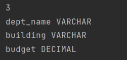


## <u>ODBC (Open Database Connectivity )</u>


## <u>Embedded SQL</u>


**********************************************************************************************************************************************************************************************************************************************************************************************************************************


- SQL is traditionally a declarative language, used primarily for querying and modifying data.
- However, most database systems (like MySQL, PostgreSQL, Oracle, and SQL Server) extend SQL with **procedural constructs** to support more complex operations.
- These constructs allow you to define control flows, variables, and even loops within SQL code.
- They are often used in **Stored Procedures** and **Functions**.


### <u>Procedure Construct</u>

- A **procedure construct** is a general term that refers to any block of code or sequence of instructions used to perform a specific task. In databases, procedure constructs usually refer to how SQL can be organized into logical blocks of code (like loops, conditionals, etc.).
- These are programming-like constructs embedded in SQL that allow you to write logic, such as loops, conditionals, and variable declarations. They help control the flow of SQL execution. 

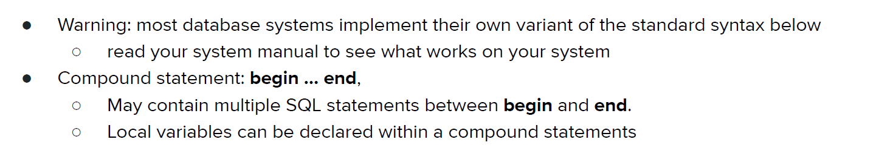

**While and Repeat Statement**

```sql
declare n integer default 0;
while n < 10 do
	set n = n + 1
end while

repeat
	set n = n – 1
until n = 0
end repeat
```

**For loop**

```sql
declare n integer default 0;
for r as
	select budget from department
	where dept_name = ‘Music’
do
	set n = n - r.budget
end for
```


### <u>External Language Functions/Procedures</u>

- **SQL:1999 Standard**  version of SQL allows the use of functions and procedures written in other languages, such as **C** or **C++**.

- **Procedure Example**:
  
  ```sql
  create procedure dept_count_proc(in dept_name varchar(20),
                                   out count integer)
  language C
  external name '/usr/avi/bin/dept_count_proc';
  ```
  This defines a procedure `dept_count_proc` with one input parameter (`dept_name`) of type `varchar(20)`, and one output parameter (`count`) of type `integer`. The procedure is written in C, and the external implementation is located at `/usr/avi/bin/dept_count_proc`.
  
- **Function Example**:
  
  ```sql
  create function dept_count(dept_name varchar(20))
  returns integer
  language C
  external name '/usr/avi/bin/dept_count';
  ```
  This defines a function `dept_count` that takes `dept_name` as input (type `varchar(20)`), and returns an `integer`. This function is also written in C and is located at `/usr/avi/bin/dept_count`.

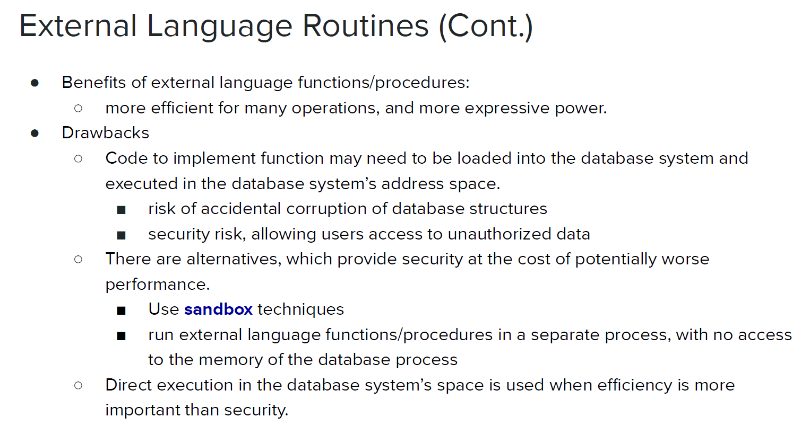

**Sandbox Techniques**

- The **sandbox technique** is a security mechanism used in software development to isolate code execution in a controlled environment. The primary goal of a sandbox is to run untrusted or potentially harmful code without affecting the overall system, preventing it from accessing or modifying sensitive data or resources. 


### <u>SQL Functions</u>

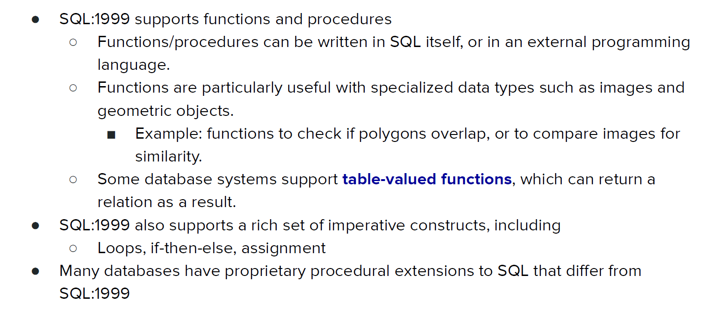

- Define a function that, given the name of a department, returns the count of the number of instructors in that department.

```sql
CREATE FUNCTION dept_count(dept_name VARCHAR(20))
RETURNS INTEGER
BEGIN
    DECLARE d_count INTEGER;
    
    -- Get the count of instructors in the specified department
    SELECT COUNT(*) INTO d_count
    FROM instructor
    WHERE instructor.dept_name = dept_name;

    -- Return the count
    RETURN d_count;
END;
```

- The `SELECT` statement calculates the number of instructors in the specified department and stores the result in the variable `d_count`.
- Find the department name and budget of all departments with more than 12 instructors.

```sql
SELECT dept_name, budget
FROM department
WHERE dept_count(dept_name) > 12;
```


### <u>Table Functions</u>

- Table functions are a powerful feature introduced in SQL:2003 that allow you to return an entire relation (or table) as the result of a function.
- This is useful for cases where you need a query to return multiple rows or columns as opposed to a single value.

```sql
CREATE FUNCTION instructors_of(dept_name CHAR(20))
RETURNS TABLE ( /*Specifies that the function will return a table (relation) with the following columns*/
    ID VARCHAR(5),
    name VARCHAR(20),
    dept_name VARCHAR(20),
    salary NUMERIC(8, 2)
)
AS
RETURN /*This is where the function specifies what data it returns. In this case, the function returns the result of the SELECT statement.*/
(
    SELECT ID, name, dept_name, salary
    FROM instructor
    WHERE instructor.dept_name = dept_name
);
```

- To get all instructors from a particular department (e.g., "Music"), you can use the function in a `SELECT` statement.

  ```sql
  SELECT *
  FROM TABLE (instructors_of('Music'));
  ```

<mark>Table functions are not available in mysql</mark>

> [!IMPORTANT]
>
> ### How to Handle It in MySQL:
>
> If you want to retrieve data from a query based on a department name, you would need to use a **stored procedure** instead of a function.
>
> ### Example of Stored Procedure to Return a Result Set in MySQL:
>
> ```sql
> DELIMITER $$ /*this is not compulsary.This is used to avoid confusing sql becouse in a fn or a procedure we use multiple ;(default delimiter)->we change this to $$ during the fn or procedure */
> 
> CREATE PROCEDURE instructors_of(IN dept_name CHAR(20))
> BEGIN
>     SELECT ID, name, dept_name, salary
>     FROM instructor
>     WHERE dept_name = dept_name;
> END $$
> 
> DELIMITER ;
> ```
>
> ### Explanation:
>
> - **Stored Procedure**: `instructors_of` is a procedure that accepts an input parameter `dept_name`.
> - **SELECT Statement**: The procedure performs a `SELECT` query to return all instructors in the given department.
>
> ### To Call the Stored Procedure:
>
> ```sql
> CALL instructors_of('Music');
> ```
>
> This will execute the procedure and return a table-like result set containing the instructor information for the 'Music' department.


### <u>SQL Procedures / Store Procedures</u>

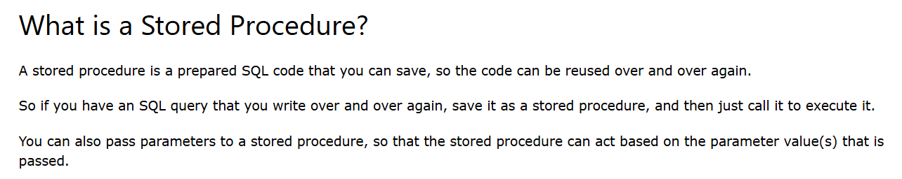

- Here is an example of a procedure to count the number of instructors in a department:

```sql
CREATE PROCEDURE dept_count_proc (
    IN dept_name VARCHAR(20),
    OUT d_count INTEGER
)
BEGIN
    SELECT COUNT(*)
    INTO d_count
    FROM instructor
    WHERE instructor.dept_name = dept_name;
END;
```

- In this procedure:
  - **IN parameter (`dept_name`)**: Passed into the procedure by the caller.

  - **OUT parameter (`d_count`)**: The procedure computes the count of instructors in the specified department and assigns it to this variable, which is returned to the caller.


- The procedure can be invoked using the `CALL` statement as follows:

```sql
DECLARE d_count INTEGER;
CALL dept_count_proc('Physics', d_count);
```

**Procedure Invocation in Dynamic SQL**

- Procedures and functions can also be invoked from dynamic SQL, which allows SQL code to be constructed and executed at runtime, providing flexibility in scenarios where the exact SQL command isn't known until execution.


**Function/Procedure Overloading**

- With SQL:1999, it is possible to have multiple functions or procedures with the same name, but with different numbers or types of arguments, similar to how method overloading works in many programming languages.
- This feature is known as **name overloading**. For instance, you could create another `dept_count_proc` procedure with different parameters, and the correct one would be called based on the provided arguments.


#### <u>SQL Procedures vs SQL Functions</u>

**Procedure:**

```SQL
CREATE PROCEDURE update_salary (
    IN emp_id INT, 
    IN new_salary DECIMAL
)
BEGIN
    UPDATE employee
    SET salary = new_salary
    WHERE id = emp_id;
END;
```

```SQL
CALL update_salary(emp_id, new_salary);
```

**Function:**

```SQL
CREATE FUNCTION get_employee_age (emp_id INT) 
RETURNS INT
BEGIN
    DECLARE emp_age INT;
    SELECT age INTO emp_age FROM employee WHERE id = emp_id;
    RETURN emp_age;
END;
```

```sql
SELECT get_employee_age(emp_id);
```


| Feature                        | Procedure                            | Function                     |
| ------------------------------ | ------------------------------------ | ---------------------------- |
| **Returns a value**            | No (can return via `OUT` parameters) | Yes (always returns a value) |
| **Can modify data**            | Yes                                  | No (ideally)                 |
| **Can be used in SQL queries** | No                                   | Yes                          |
| **Transaction control**        | Allowed                              | Not allowed                  |
| **Error handling**             | Flexible                             | Limited                      |
| **Overloading**                | Yes                                  | Yes                          |

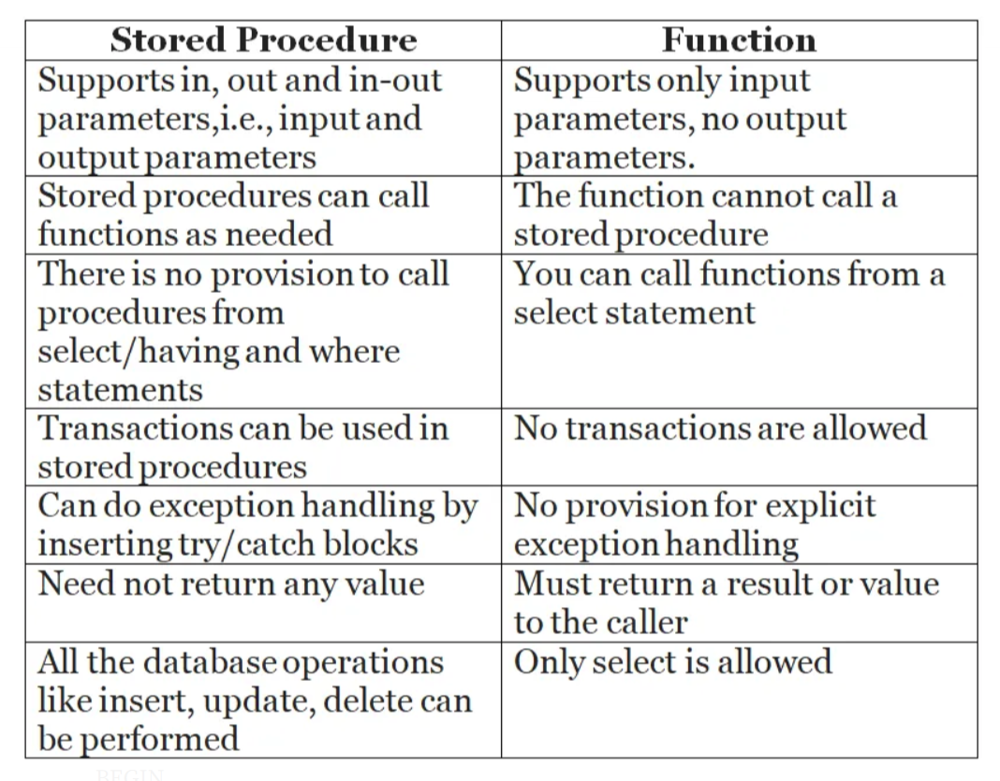

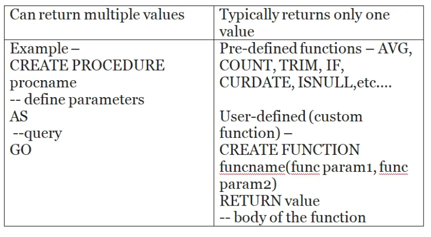

### <u>Triggers</u>

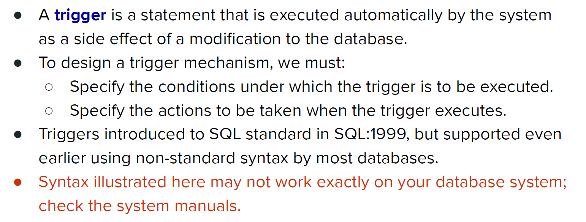

[SQL | Triggers - GeeksforGeeks](https://www.geeksforgeeks.org/sql-triggers/)

- Below example aims to enforce a constraint by ensuring that the `time_slot_id` in the `section` table exists in the `time_slot` table.


**Trigger Creation for Insertions:**

```sql
CREATE TRIGGER timeslot_check1
AFTER INSERT ON section
FOR EACH ROW
BEGIN
    -- Check if the inserted time_slot_id exists in the time_slot table
    IF NOT EXISTS (
        SELECT 1
        FROM time_slot
        WHERE time_slot_id = NEW.time_slot_id
    ) THEN
        -- If not, raise an error to prevent the insertion
        SIGNAL SQLSTATE '45000'
        SET MESSAGE_TEXT = 'Invalid time_slot_id: value does not exist in time_slot table';
    END IF;
END;
```

This SQL trigger is designed to enforce data integrity in your database. Here's a breakdown of what it does:

1. **Trigger Name and Timing**: The trigger is named `timeslot_check1` and is set to execute **after** a new row is inserted into the `section` table. This means it will check the data after the insert operation is completed.
2. **Trigger Execution**: For each row being inserted (`FOR EACH ROW`), the trigger performs the following steps:
3. **Check Time Slot Validity**: It checks if the `time_slot_id` value being inserted into the `section` table exists in the `time_slot` table. This is done using an `IF NOT EXISTS` clause, which executes a `SELECT` statement to see if there is a matching `time_slot_id` in the `time_slot` table.
4. **Error Handling**: If the `time_slot_id` does not exist in the `time_slot` table (i.e., the `SELECT` statement returns no rows), the trigger raises an error using `SIGNAL SQLSTATE '45000'`. The error message provided is 'Invalid time_slot_id: value does not exist in time_slot table'.


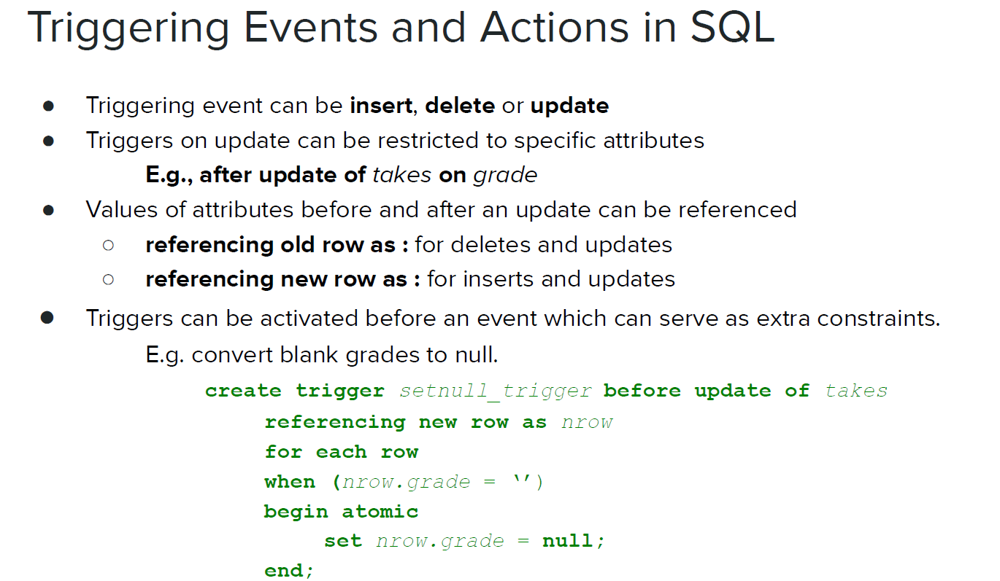


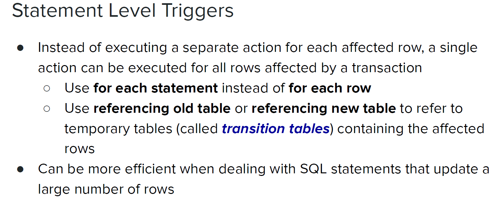

**Statement-Level vs Row-Level Triggers**

- **Row-Level Triggers**: These triggers run **once for each row** affected by an `INSERT`, `UPDATE`, or `DELETE` statement. If you insert, update, or delete multiple rows, the trigger will be executed separately for each row.
  
- **Statement-Level Triggers**: These are triggered **once per SQL statement**, regardless of how many rows are affected. This is useful for large transactions where handling each row individually would be inefficient.


**Example of a Statement-Level Trigger**

Let’s look at an example where you want to update a log table every time rows in the `orders` table are updated. Instead of logging every single row change, we can log once per update operation.

```sql
CREATE TRIGGER log_order_updates
AFTER UPDATE ON orders
FOR EACH STATEMENT
REFERENCING OLD TABLE AS old_orders
NEW TABLE AS new_orders
BEGIN
    DECLARE total_updated INT;

    -- Count how many rows were updated
    SELECT COUNT(*) INTO total_updated
    FROM old_orders;

    -- Insert log entry with the count of updated rows
    INSERT INTO update_log (log_message, log_timestamp)
    VALUES (CONCAT(total_updated, ' rows were updated in the orders table.'), CURRENT_TIMESTAMP);
END;
```

1. **Trigger Definition**:
   - This is an `AFTER UPDATE` trigger, so it will fire after the `UPDATE` operation is complete on the `orders` table.

2. **FOR EACH STATEMENT**:
   - This makes it a statement-level trigger, meaning it runs **once per SQL statement**, not for each row that’s updated.

3. **Transition Tables**:
   - `REFERENCING OLD TABLE AS old_orders NEW TABLE AS new_orders` creates temporary tables that contain the rows before (`old_orders`) and after (`new_orders`) the `UPDATE` operation.
   - You can think of these transition tables as snapshots of the affected rows.

4. **Counting Rows**:
   - We calculate how many rows were updated by counting the rows in `old_orders` (the rows that were changed).

5. **Logging**:
   - The trigger logs a message into the `update_log` table with the total number of updated rows, along with the current timestamp.


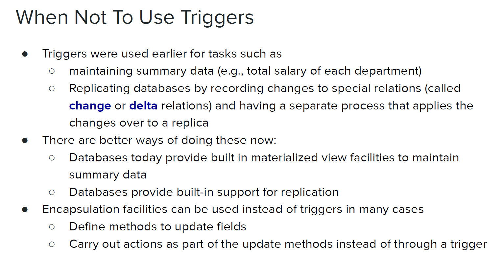


## <u>Ranking</u>

- Ranking functions are powerful tools in SQL for assigning ranks to rows based on specific criteria.
- They are particularly useful for generating leaderboards, performance rankings, and other ordered metrics.

**Ranking Functions**

1. **`RANK()`**: Assigns a unique rank to each distinct row within the partition of a result set. If there are ties (i.e., identical values), the same rank is given to tied rows, and the next rank(s) are skipped. For example, if two students are tied for 1st place, the next rank will be 3rd place.

2. **`DENSE_RANK()`**: Similar to `RANK()`, but does not leave gaps between ranks. If two students are tied for 1st place, the next rank is 2nd place, and so forth.


**Using `RANK()`**:

```sql
SELECT ID, RANK() OVER (ORDER BY GPA DESC) AS s_rank
FROM student_grades
ORDER BY s_rank;
```

- If two students have the same top GPA, both will get a rank of 1, and the next rank will be 3.


**Using `DENSE_RANK()`**:

```sql
SELECT ID, DENSE_RANK() OVER (ORDER BY GPA DESC) AS s_rank
FROM student_grades
ORDER BY s_rank;
```

- With `DENSE_RANK()`, if two students are tied for 1st place, the next rank will be 2nd place, avoiding gaps in ranking.


### 

## <u>Windowing</u>


### <u>Authorization Specification in SQL</u>

### <u>Privileges in SQL</u>

### <u>Revoking Authorization in SQL</u>

### <u>Roles</u>

### 
