## Question 1:

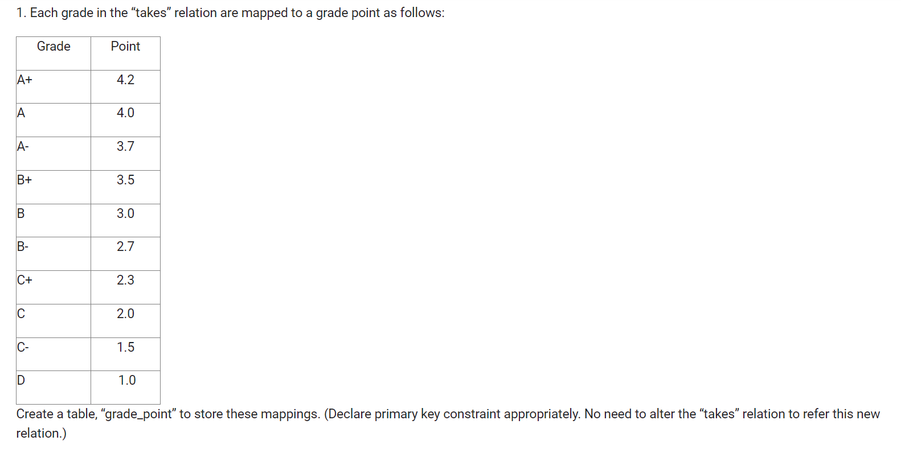

<u>SQL</u>

```sql
create table grade_point (
    Grade varchar(3) primary key ,
    Point decimal(2,1) not null
);
```

<u>Output log</u>

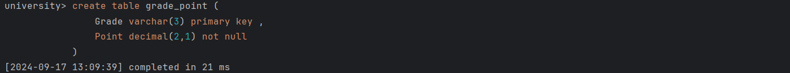

------

## Question 2:


<u>SQL</u>

```sql
insert into grade_point (Grade, Point)
values('A+',4.2),('A',4.0),('A-',3.7),('B+',3.5),('B',3.0),('B-',2.7),('C+',2.3),('C',2.0),('C-',1.5),('D',1.0);
```

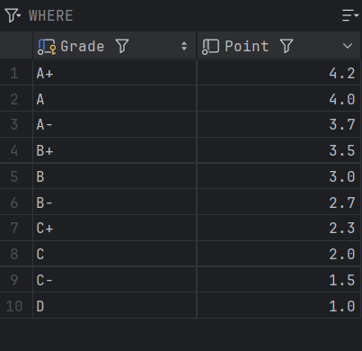

<u>Output log</u>

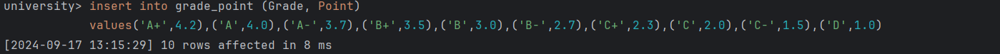

------

## Question 3:


<u>SQL</u>

```sql
select student.name,sum(grade_point.Point) as GP
from student left outer join takes on student.ID = takes.ID
left outer join  grade_point on takes.grade=grade_point.Grade
group by student.name
order by GP desc;
```

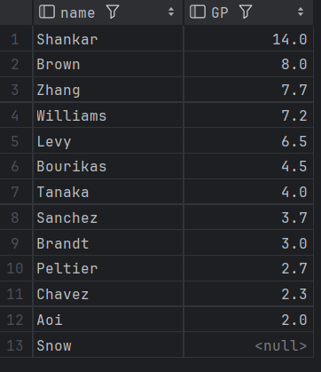

<u>Output log</u>

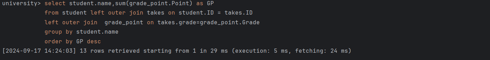

------

## Question 4:


<u>SQL</u>

```sql
DELIMITER $$
create function num_of_enrollment(course_id varchar(8)) returns int
deterministic
begin
    declare num int;

    select count(takes.course_id) into num
        from takes
        where takes.course_id =course_id;

    return num;
end $$
DELIMITER ;
```

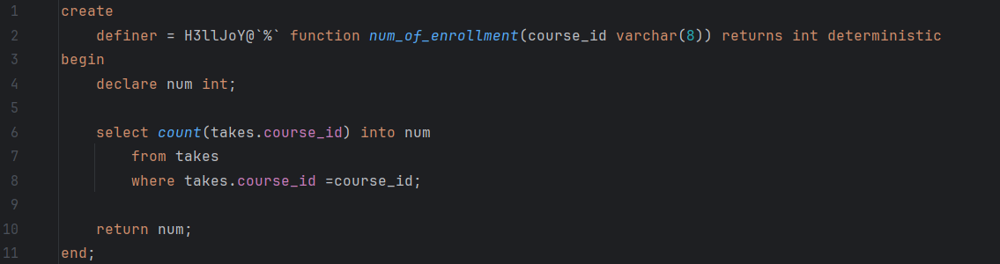

<u>Output log</u>
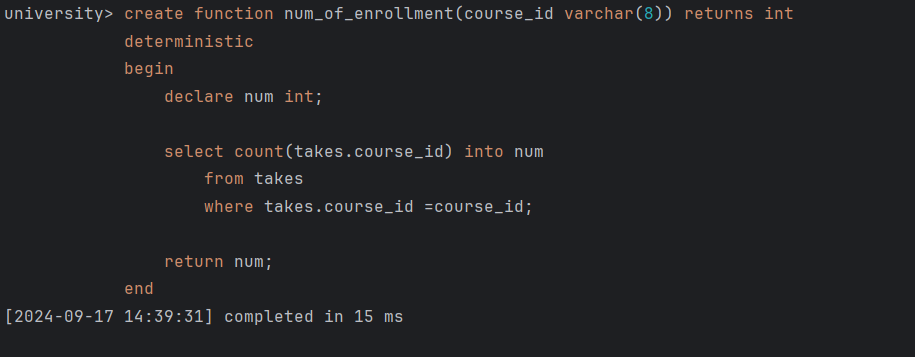

------

## Question 5:


<u>SQL</u>

```sql
select distinct takes.course_id
from takes
where num_of_enrollment(takes.course_id)>5
order by course_id ;
```

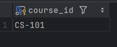

<u>Output log</u>

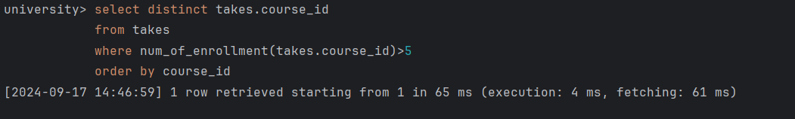

------

## Question 6


<u>SQL</u>

```sql
DELIMITER $$
CREATE TRIGGER check_grades
before insert on takes
    for each row
    begin
        IF NOT EXISTS(
            select 1
            from grade_point
            where grade_point.Grade = new.grade
        )then
            SET new.grade = NULL;
        end if;
    end $$
DELIMITER ;
```

<u>Output log</u>

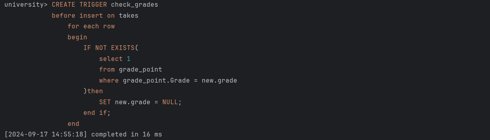

------

## Question 7


<u>SQL</u>

```sql
create view faculty as
select ID,name,dept_name
from instructor;
```

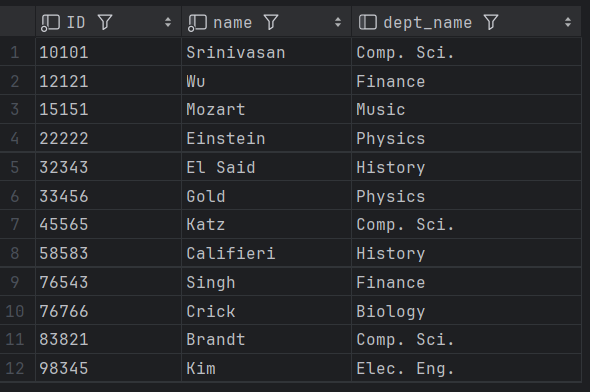

<u>Output log</u>

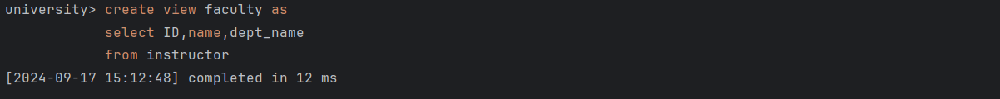

------

## Question 8


<u>SQL</u>

```sql
create user 'uomcse'@'localhost' identified by 'uomcse123';
```

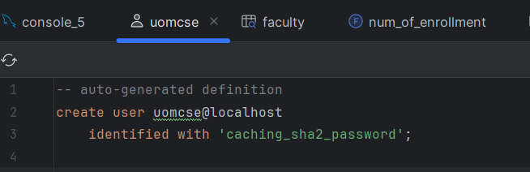

<u>Output log</u>

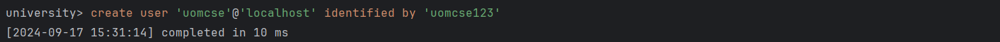

------

## Question 9


<u>SQL</u>

```sql
GRANT SELECT ON faculty TO 'uomcse'@'localhost';
```

<u>Output Log</u>

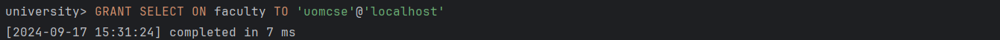

------

## Question 10


<u>SQL</u>

```sql
GRANT all privileges ON takes TO 'uomcse'@'localhost';
```

<u>Output Log</u>

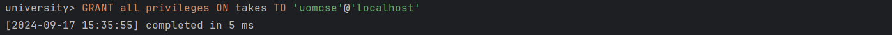

------

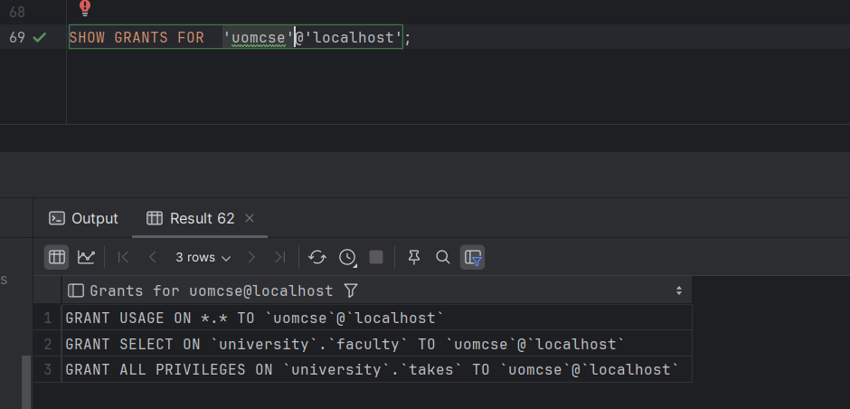